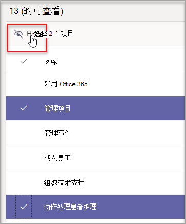
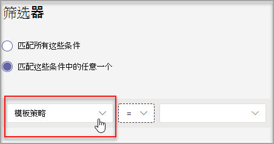

# 管理中心中的 Teams 模板

在管理中心创建模板策略，管理最终用户看到的 Teams 模板。 在每个模板策略中，可以指定显示或隐藏的模板。
将不同的用户分配到不同的模板策略，以便用户仅查看指定的 Teams 模板子集。

观看此简短视频，了解如何管理模板策略。

> [!VIDEO https://www.microsoft.com/videoplayer/embed/RWyXL9]

## 创建模板策略并分配可用模板

1. 登录到 Teams 管理中心。

2. 展开 **"Teams**  >  **模板策略"。**

3. 选择“**添加**”。

    

1. 在" **模板策略设置"** 部分中，完成以下字段：

    - 模板策略名称

    - 模板策略简短说明

2. 在"**可查看的模板"** 表中，选择要隐藏的模板，然后选择"隐藏 **"。**

    

    可以在"隐藏模板"表中查看已选择 **隐藏的模板。**

1. 若要取消隐藏某些模板，请滚动到"隐藏 **模板"** 表。

1. 选择要取消隐藏模板，然后选择"显示 **"。**

   

   所选模板将显示在"可查看的模板 **"** 表中。
3. 选择"**保存"。**

   新模板策略显示在"模板 **策略"** 列表中。

## 将用户分配到模板策略

分配到策略的用户只能查看该策略中的可查看模板。

1. 在 **"模板策略"** 中，选择一个策略，然后选择"**管理用户"。**

2. 键入要分配到此策略的用户。

   

3. 选择"**应用"。**

> [!Note]
> 新策略最多可能需要 24 小时才能对最终用户生效。

## 模板策略的大小限制

可以隐藏每个策略最多 100 个模板。 如果 **给定** 策略已隐藏 100 个模板，则禁用"隐藏"按钮。

## 常见问题解答

**问：能否批量将用户分配到团队模板策略？**
  
答：是的，我们支持在 PowerShell 中对模板策略进行批处理分配。 此操作的策略类型是 TeamsTemplatePermissionPolicy。 [了解更多信息](https://docs.microsoft.com/powershell/module/teams/new-csbatchpolicyassignmentoperation)

**问：能否将组分配到团队模板策略？**

答：目前没有。 将来会提供此功能。

**问：如果创建了一个新模板，该模板是否将包含在策略中？**

答：默认情况下，任何新模板都可见。 可以选择在"模板策略"部分的管理中心中隐藏模板。

**问：删除模板后会发生什么情况？**

答：任何已删除的模板将不再存在于任何模板策略中。

**问：能否将多个用户分配到 Teams 管理中心中的模板策略？**

答：可以。

1. 在管理中心，转到"用户 **"。**
1. 在"用户"列表表中，选择要分配到特定模板策略的用户。
1. 选择"编辑设置"，并更改"模板策略"字段。
1. 选择"应用"。
   详细了解在[Microsoft Teams 中为用户分配策略 - Microsoft Teams \| Microsoft Docs。](https://docs.microsoft.com/microsoftteams/assign-policies#assign-a-policy-to-a-batch-of-users)

**问：如何查看分配到特定策略的所有用户？**

答：在管理中心：

1. 转到"用户 **"** 部分。
2. 在"用户"列表表中选择筛选器，然后筛选团队模板策略。
3. 选择"**应用"。**

**问：能否通过 PowerShell 管理模板策略？**

答：不支持在 PowerShell 中管理模板。

**问：模板策略是否适用于 EDU？**

答：不支持 EDU 的模板策略。

## 相关主题

- [管理中心中的团队模板入门](https://docs.microsoft.com/MicrosoftTeams/get-started-with-teams-templates-in-the-admin-console)

- [创建自定义团队模板](https://docs.microsoft.com/MicrosoftTeams/create-a-team-template)

- [从现有团队创建模板](https://docs.microsoft.com/MicrosoftTeams/create-template-from-existing-team)

- [从现有团队模板创建团队模板](https://docs.microsoft.com/MicrosoftTeams/create-template-from-existing-template)

- [在 Microsoft Teams 中向用户分配策略 - Microsoft Teams \| Microsoft Docs](https://docs.microsoft.com/microsoftteams/assign-policies)

- [将用户批量分配到策略](https://docs.microsoft.com/powershell/module/teams/new-csbatchpolicyassignmentoperation)
