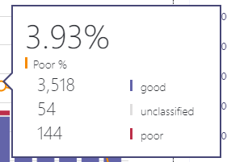

# 打开和使用 Microsoft 团队和 Skype for business Online 的通话质量仪表板Turn on and use Call Quality Dashboard for Microsoft Teams and Skype for Business Online

了解如何配置 Office 365 组织以使用呼叫质量仪表板来监控通话质量。Learn how to configure your Office 365 organization to use the Call Quality Dashboard to monitor call quality.
  
通话质量仪表板（CQD）可深入了解使用 Microsoft 团队和 Skype for business Online 服务进行的通话的质量。Call Quality Dashboard (CQD) provides insight into the quality of calls made using Microsoft Teams and Skype for Business Online services. 本主题介绍了开始收集可用于解决通话质量问题的数据的步骤。This topic describes the steps to start collecting data you can use to troubleshoot call quality issues.

目前，高级 CQD 和 CQD 都可供使用。Currently, Advanced CQD and CQD are both available for use. 可在https://cqd.teams.microsoft.com使用高级 CQD。Advanced CQD is available at https://cqd.teams.microsoft.com. 新 URL，但具有管理员凭据的相同日志。New URL but the same log in with your administrator credentials.

## 使用 Power BI 分析 CQD 数据Use Power BI to analyze CQD data

2020年1月[的新增功能：下载 CQD 的 POWER BI 查询模板](https://github.com/MicrosoftDocs/OfficeDocs-SkypeForBusiness/blob/live/Teams/downloads/CQD-Power-BI-query-templates.zip?raw=true)。New in January 2020: [Download Power BI query templates for CQD](https://github.com/MicrosoftDocs/OfficeDocs-SkypeForBusiness/blob/live/Teams/downloads/CQD-Power-BI-query-templates.zip?raw=true). 可用于分析和报告 CQD 数据的自定义 Power BI 模板。Customizable Power BI templates you can use to analyze and report your CQD data.

已阅读 "[使用 POWER BI 分析 CQD 数据](CQD-Power-BI-query-templates.md)" 以了解详细信息。Read [Use Power BI to analyze CQD data](CQD-Power-BI-query-templates.md) to learn more.

## 最新更改和更新Latest changes and updates

更新后的 CQD （2019年11月早些时候）提供接近实时 CQD 仪表板的时间。The updated CQD (as of early November 2019) delivers a Near Real-Time CQD dashboard. CQD 数据现在将在30分钟内可用（与上一个 CQD 相比，它平均为24小时）。CQD data is now available on average in 30 minutes (in comparison to the previous CQD which is on average of 24 hours).  已更新的 CQD 使用最终用户可识别信息（EUII），使管理员能够向下钻取并放大到用户级别。The updated CQD uses End User Identifiable Information (EUII), giving admins the ability to drill down and zoom in to the user level. 还提供支持新方案的报表交互，例如：There is also report interactivity to support new scenarios such as:

- 按地区呼叫质量：Call Quality by Region:
  - 按区域日期date-by-region
  - 按区域聚合到每个小时aggregated down to hour-by-region
  - 特定位置specific locations
  - 特定子网specific subnet
  - 受影响的用户或用户impacted user or users

- 按地区呼叫可靠性/失败：Call Reliability/Failure by Region:
  - 按区域日期date-by-region
  - 按区域聚合到每个小时aggregated down to hour-by-region
  - 特定位置specific locations
  - 特定子网specific subnet
  - 受影响的用户或用户impacted user or users

- 按区域对我的呼叫（RMC）进行评级：从按区域聚合到特定位置的特定位置到提供低 RMC 等级的用户。Rate My Call (RMC) by Region: from month-by-region aggregated down to specific locations to users who provide low RMC ratings. CQD v3 还包括逐字反馈。CQD v3 also includes verbatim feedback.
- 帮助者：可用于 P2P 呼叫或会议的特定用户或所有参与者和通话详细信息。Helpdesk: available for a specific user on P2P calls or Meetings, or for all participants and call details. 帮助识别基于网络位置、设备或固件的可能系统问题。Helps identify possible system issues based on network location, devices, or firmware.  
- 客户端版本：查看每个客户端版本的会话和用户计数，或向下钻取以查看每个客户端版本的用户名。Client Versions: View the Session and Users counts for each Client Version, or drill down to User names for each client version. 产品和客户端类型的预生成筛选器帮助将版本集中到特定客户端。Pre-built filters for Product and Client Type help focus the versions to specific clients.
- 终结点：显示映射到电脑/Mac 的 "生成/模型" 的计算机终结点。Endpoints: Shows Machine Endpoints mapped to Make/Model of the PC/Mac. 按 "生成/模型" 显示聚合质量。Shows aggregated quality by Make/Model. 映射数据的上载类似于生成数据。Mapping data is uploaded similar to Building data.

如果 EUII access 不可用，则高级 CQD （V3）还提供 RBAC 支持。Advanced CQD (V3) also provides RBAC support, in case EUII access is not available.  

管理员可通过 CQD 版本3管理 Skype for business Server 2019 （不仅仅是 Skype for business Online 和 Microsoft 团队）。An admin can manage Skype for Business Server 2019 (not just Skype for Business Online and Microsoft Teams) through CQD version 3. 这需要混合实现和使用 "调用数据" 连接器。This requires a hybrid implementation and the use of Call Data Connector. 有关详细信息，请参阅[计划通话数据连接器](/SkypeForBusiness/hybrid/plan-call-data-connector)。See [Plan Call Data Connector](/SkypeForBusiness/hybrid/plan-call-data-connector) for more information.

已添加 CQD 版本2：CQD version 2 added:

- Microsoft 团队和 Skype for business Online 的数据Data for Microsoft Teams and Skype for Business Online
- 摘要报告包括一个用于选择所有数据、Microsoft 团队数据或 Skype for Business Online 数据的产品筛选器Summary reports include a product filter to select all data, Microsoft Teams data, or Skype for Business Online data
- 更新了视频和 VBSS 流质量分类逻辑。Updated Video and VBSS stream quality classification logic. 请参阅用于分类器定义的[通话质量仪表板中的流分类](stream-classification-in-call-quality-dashboard.md)。Refer to [Stream Classification in Call Quality Dashboard](stream-classification-in-call-quality-dashboard.md) for the classifier definitions.

有关[通话质量仪表板中可用的维度和度量](dimensions-and-measures-available-in-call-quality-dashboard.md)的列表，请参阅本文。Refer to this article for a list of [Dimensions and measures available in Call Quality Dashboard](dimensions-and-measures-available-in-call-quality-dashboard.md).
  
> [!NOTE]
> 若要查看有关仪表板的更新和更改的信息，请单击 "**好消息**" 中的链接！To see information about updates and changes to the dashboard,  click the link in the **Good news!** 在仪表板上显示时横幅。banner when it displays on the dashboard.

CQD 版本1已提供 Skype for Business Server 2015 管理员以下功能：CQD version 1 provided Skype for Business Server 2015 admins the following features:

- 访问缓存的报表数据以快速访问Access to cached report data for fast access
- 指向用于共享和发布信息的报表页面的深层链接Deep links to report pages for sharing and publishing information
- 简化的报表编辑和创建以及报表说明的可编辑元数据Streamlined report editing and creation, and editable metadata for report descriptions
- 为在自定义仪表板中使用而提供对多维数据集数据的编程访问的 Web ApiWeb APIs that give programmatic access to the cube data for use in custom dashboards

## CQD 近实时（NRT）数据CQD Near-Real-Time (NRT) Data

高级 CQD （V3，发布2019年11月）使用近乎实时的数据馈送。Advanced CQD (V3, released November 2019) uses a near-real-time data feed. 通话记录在通话结束后的30分钟内将在 CQD 门户中可用。Call Records are available at the CQD portal within 30 minutes of the end of the call. 从 NRT 管道中调用记录仅在从数据集内删除几个月后才可用。Call Records from the NRT pipeline are only available for a few months before they are removed from the data set. CQD v3 将当前 v2 管道中的数据与 v3 管道中的 NRT 数据合并。CQD v3 merges data from the current v2 pipeline with NRT data from the v3 pipeline. 来自存档周期的数据的 v2 和 v3 门户查询将产生相同的结果。Queries on the v2 and v3 portals for the data from the Archival period produce the same results. NRT 数据的 V2 和 v3 数据查询和 NRT Data + PII 期间将有所不同。V2 and v3 data queries for the NRT Data and NRT Data + PII periods will be different.

### PII/EUII 数据PII/EUII Data

PII 或 EUII 数据仅来自 v3 管道。PII or EUII data only comes from the v3 pipeline. 由于合规性原因，PII/EUII 数据仅保留30天。Due to compliance reasons, PII/EUII data is only kept for 30 days. 由于 NRT 数据超过30天的标记，将清除 PII/EUII 字段，从而导致 PII NRT 数据。As NRT data crosses the 30-day mark, the PII/EUII fields are cleared out, resulting in PII-free NRT data. PII/EUII 字段是：The PII/EUII fields are:

- 完整 IP 地址Full IP address
- 媒体访问控制（MAC）地址Media Access Control (MAC) Address
- 基本服务集标识符（BSSID）Basic Service Set identifier (BSSID)
- 会话初始协议（SIP） URI （仅 Skype for business）Session Initiation Protocol (SIP) URI (Skype for Business only)
- 用户主体名称 (UPN)User Principal Name (UPN)
- 计算机终结点名称Machine Endpoint Name
- 用户逐字反馈User Verbatim Feedback
- 对象 ID （终结点用户的 Active Directory 对象 ID）Object ID (the Active Directory object ID of the endpoint's user)

### 日期控件Date controls

CQD v3 将添加以下新的滚动趋势类型：CQD v3 adds the following new Rolling Trend types:

- 5天5-day
- 7天7-day
- 30天30-day
- 60-day60-day
- 90-day90-day

URL 日期参数现在可接受 "天" 字段。The URL Date parameter can now accept a Day field. "滚动日期" 报告将 "YYYY-MM-DD 格式" 中指定的日期用作趋势的最后一天。Rolling-day reports use dates specified in the YYYY-MM-DD format as the last day of the trend.  URL 日期参数 "00" 表示 "今日"。The URL Date parameter “00”  indicates “today”.

|URLURL| 滚动日趋势的结束日期End date of Rolling Day Trend|
|:---|:---|
|https://<cqdv3>/Spd/#/Dashboard/<reportid>/2019-02/https://<cqdv3>/spd/#/Dashboard/<reportid>/2019-02/   |2019年2月的当前日期Current Day of Feb 2019|
|https://<cqdv3>/Spd/#/Dashboard/<reportid>/2019-02-15/https://<cqdv3>/spd/#/Dashboard/<reportid>/2019-02-15/|2019年2月15日Feb 15, 2019|
|https://<cqdv3>/Spd/#/Dashboard/<reportid>/00/https://<cqdv3>/spd/#/Dashboard/<reportid>/00/        |当前日期Current Day|
|||

默认情况下，该月的当前日期用作滚动日期趋势的最后一天。By default the current day of the month is used as the last day of the Rolling Day Trend.

### 钻取功能Drill Thru Functionality

CQD v3 支持使用 SPD 报表中的钻取或向下钻取字段。CQD v3 supports the use of drill through or drill-down fields in SPD reports. 如果选择这些维度字段，报表将自动打开不同的 "报表" 选项卡，并筛选所选值。If these dimension fields are selected,  the report automatically opens a different report tab and filters on the selected value. 将鼠标悬停在其上方时，具有分配的钻取筛选器的字段将由不同的光标图标（指针）进行区分。Fields with an assigned drill through filter are distinguished by a different cursor icon (the pointer) when you hover over them.

选中 "钻取" 字段时，仪表板将自动导航到新的指定选项卡，并应用具有所选值的筛选器。When a drill through field is selected, the Dashboard automatically navigates to the new, specified tab and applies a filter with the selected value. 如果该选项卡具有自己的钻取字段，并且选择了一个，则以前的钻取筛选器和新的钻取筛选器以及新的钻取。If that tab has its own drill through fields and one is selected, the previous drill through filters and the new one all propagate forward. 这允许你构建可逐渐缩小结果数据集的报表。This allows you to build a report that progressively narrows the resulting data set.

例如，在通话质量的钻取报表中，用户可以单击想要 "钻取" 的日期，这将导致 "位置" 选项卡。For example, in a Call quality drill-through report, a user can click the date they would like to 'drill-through', which leads to the Location tab.

可以从 "位置" 选项卡添加多个日期，例如将2019-09-22 添加到日期：2019-09-24：You can add multiple dates from the location tab, such as adding 2019-09-22 to Date: 2019-09-24: 

> [!NOTE]
> 不要直接跳转到最后一个选项卡。没有从以前的钻取中选择的筛选器，结果将太大，无法在表格上显示。Don't jump directly to the last tab. Without filters selected from a previous drill-through the results would be too large to show on a table.

## 激活 Microsoft 通话质量仪表板（CQD）摘要报告Activate Microsoft Call Quality Dashboard (CQD) Summary Reports

在开始使用 CQD 之前，请为您的 Office 365 组织激活它，如下所示：Before you can start using CQD, activate it for your Office 365 organization as follows:

 **使用 microsoft 团队管理中心**显示 microsoft 团队徽标的图标 **Using the Microsoft Teams admin center**

1. 使用 Microsoft 团队服务管理员帐户登录到你的 Office 365 组织，然后选择 "**管理员**" 磁贴以打开管理中心。Sign in to your Office 365 organization using Microsoft Teams service admin account, and then select the **Admin** tile to open the Admin center.
2. 在左窗格中的 "**管理中心**" 下，选择 " **microsoft 团队**" 以打开 "microsoft 团队管理中心"。In the left pane, under **Admin centers**, select **Microsoft Teams** to open the Microsoft Teams admin center.
3. 在 "Microsoft 团队管理中心" 中，在左窗格中选择 "**呼叫质量" 仪表板**。In the Microsoft Teams admin center, select **Call quality dashboard** in the left pane.
4. \(在打开 https://cqd.teams.microsoft.com\)的页面上，单击 "**登录**"，然后输入全局管理员帐户或 microsoft 团队服务管理员帐户信息。On the page that opens \(https://cqd.teams.microsoft.com\), click **Sign in** and enter your Global Administrator account or Microsoft Teams Service Admin account information.

    
  
登录后，一旦激活，CQD 将开始收集和处理数据。After you sign in, once activated, the CQD will begin collecting and processing data.  
> [!NOTE]
> 可能需要一个或多个小时才能处理足够的数据，以在报表中显示有意义的结果。It may take one or more hours to process enough data to display meaningful results in the reports.

 **使用 skype for business 旧版门户**的 skype for business 徽标的图标 **Using the Skype for Business legacy portal**

1. 使用管理员帐户登录到您的 Office 365 组织，然后选择 "**管理员**" 磁贴以打开管理中心。Sign in to your Office 365 organization using an admin account, and then select the **Admin** tile to open the Admin center.
2. 在左窗格中的 "**管理中心**" 下，选择 " **microsoft 团队**" 以打开 "microsoft 团队管理中心"。In the left pane, under **Admin centers**, select **Microsoft Teams** to open the Microsoft Teams admin center.
3. 在 Microsoft 团队管理中心中，在左窗格中选择 "**旧版门户**"，选择 "**工具**"，然后选择 " **Skype for Business Online 呼叫质量" 仪表板**。In the Microsoft Teams admin center, select **Legacy Portal** in the left pane, select **Tools**, and then select **Skype for Business Online Call Quality Dashboard**.

     

4. 在打开的页面上，用全局管理员帐户登录，然后在出现提示时提供帐户的凭据。On the page that opens, sign in with your Global Administrator account, and then provide the credentials for the account when prompted.

登录后，"呼叫质量" 仪表板将开始收集和处理数据。After you sign in, once activated, the Call Quality Dashboard will begin collecting and processing data.

## Microsoft 团队和 Skype for business Online 的通话质量仪表板的功能Features of the Call Quality Dashboard for Microsoft Teams and Skype for Business Online

CQD 摘要报告提供为详细报告规划的功能的子集。CQD Summary Reports provide a subset of the features planned for Detailed Reports. 此处概括介绍了版本之间的差异：The differences between the editions are summarized here:
  
|功能Feature|摘要报告Summary Reports|详细报告Detailed Reports|
|:--- |:--- |:--- |
|应用程序共享跃点数Application sharing metric | 否No | 是Yes |
|客户构建信息支持Customer building information support | 是Yes | 是 Yes |
|客户终结点信息支持Customer endpoint information support | 仅在cqd.teams.microsoft.com 中Only in cqd.teams.microsoft.com | 仅在cqd.teams.microsoft.com 中Only in cqd.teams.microsoft.com |
|向下钻取分析支持Drill down analysis support   | 否No   | 是Yes   |
|媒体可靠性指标Media reliability metrics   | 否No   | 是Yes   |
|现成的报表Out-of-the-box reports   | 是Yes   | 是 Yes   |
|概述报表Overview reports   | 是Yes   | 是 Yes   |
|每用户报告集Per-user report set   | 否No   | 是Yes   |
|报表集自定义（添加、删除、修改报表）Report set customization (add, delete, modify reports)   | 否No   | 是Yes   |
|基于视频的屏幕共享指标Video-based screen sharing metrics   | 否No   | 是Yes   |
|视频指标Video metrics   | 否No   | 是Yes   |
|可用数据量Amount of data available   | 过去12个月Last 12 months   | 过去12个月Last 12 months   |
|Microsoft 团队数据Microsoft Teams data   | 是Yes   | 是 Yes   |
| | | |

### 现成的报表Out-of-the-box reports

所有版本的 CQD 都提供了一种可提供通话质量指标的体验，无需创建新报表。All editions of CQD provide an experience that gives you call quality metrics without the need to create new reports. 在后端处理完数据后，您将在报告中看到通话质量数据。Once data is processed in the back-end, you see call quality data in the reports.

2020年1月[的新增功能：下载 CQD 的 POWER BI 查询模板](https://github.com/MicrosoftDocs/OfficeDocs-SkypeForBusiness/blob/live/Teams/downloads/CQD-Power-BI-query-templates.zip?raw=true)。New in January 2020: [Download Power BI query templates for CQD](https://github.com/MicrosoftDocs/OfficeDocs-SkypeForBusiness/blob/live/Teams/downloads/CQD-Power-BI-query-templates.zip?raw=true). 可用于分析和报告 CQD 数据的自定义 Power BI 模板。Customizable Power BI templates you can use to analyze and report your CQD data.
  
### 概述报表Overview reports

CQD 的所有版本都为整体通话质量信息提供高级别的入口点，但信息在摘要报告中的显示方式不同于详细的报告。All editions of the CQD provide a high-level entry point to the overall call quality information, but the way information is presented in Summary Reports is different from Detailed Reports.  
  
摘要报告提供简化的选项卡式页面报告视图，以便你可以快速浏览和理解整体通话质量状态和趋势。Summary Reports provide a simplified tabbed page report view so you can quickly browse and understand the overall call quality status and trends.

四个选项卡包括：The four tabs include:
  
- **整体通话质量**-提供有关所有流的信息，它是显示每月和每天的趋势的聚合：**Overall Call Quality** — provides information about all streams, which is an aggregation that shows monthly and daily trends for:
  - 服务器-客户端流Server-Client streams
  - 客户端-客户端流Client-Client streams
  - 单独的服务器-客户端和客户端-客户端流Separate Server-Client and Client-Client streams
- **服务器-客户端**-提供服务器和客户端终结点之间的流的详细信息。**Server—Client** — provides details for the streams between Server and Client endpoints.
- **客户端-客户端**-提供两个客户端终结点之间的流的详细信息。**Client—Client** — provides details for the streams between two Client endpoints.
- **语音质量 SLA** —提供有关 Skype For Business Online 语音质量 SLA 中所含通话的信息。**Voice Quality SLA** — provides information about calls that are included in the Skype for Business Online Voice Quality SLA.

> [!NOTE]
> CQD 版本3适用于 Microsoft 团队、Skype for business Online 和 Skype for business 服务器。CQD Version 3 works with Microsoft Teams, Skype for Business Online, and Skype for Business Server. 要将 CQD 与 Skype for Business Server 2019 配合使用，您必须[配置 "呼叫数据连接器](https://docs.microsoft.com/skypeforbusiness/hybrid/configure-call-data-connector)"。To use CQD with Skype for Business Server 2019, you will have to [Configure Call Data Connector](https://docs.microsoft.com/skypeforbusiness/hybrid/configure-call-data-connector). 请参阅在开始之前[计划通话数据连接器](https://docs.microsoft.com/skypeforbusiness/hybrid/plan-call-data-connector)。See [Plan Call Data Connector](https://docs.microsoft.com/skypeforbusiness/hybrid/plan-call-data-connector) before you start.

- 按地区呼叫质量：Call Quality by Region:

  - 按区域日期date-by-region
  - 按区域聚合到每个小时aggregated down to hour-by-region
  - 特定位置specific locations
  - 特定子网specific subnet
  - 受影响的用户或用户impacted user or users

- 按地区呼叫可靠性/失败：Call Reliability/Failure by Region:
  - 按区域日期date-by-region
  - 按区域聚合到每个小时aggregated down to hour-by-region
  - 特定位置specific locations
  - 特定子网specific subnet
  - 受影响的用户或用户impacted user or users

- 按区域对我的呼叫（RMC）进行评级：从按区域聚合到特定位置的特定位置到提供低 RMC 等级的用户。Rate My Call (RMC) by Region: from month-by-region aggregated down to specific locations to users who provide low RMC ratings. CQD v3 还包括逐字反馈。CQD v3 also includes verbatim feedback.
- 帮助者：可用于 P2P 呼叫或会议的特定用户或所有参与者和通话详细信息。Helpdesk: available for a specific user on P2P calls or Meetings, or for all participants and call details. 帮助识别基于网络位置、设备或固件的可能系统问题。Helps identify possible system issues based on network location, devices, or firmware.  
- 客户端版本：查看每个客户端版本的会话和用户计数，或向下钻取以查看每个客户端版本的用户名。Client Versions: View the Session and Users counts for each Client Version, or drill down to User names for each client version. 产品和客户端类型的预生成筛选器帮助将版本集中到特定客户端。Pre-built filters for Product and Client Type help focus the versions to specific clients.
- 终结点：显示映射到电脑/Mac 的 "生成/模型" 的计算机终结点。Endpoints: Shows Machine Endpoints mapped to Make/Model of the PC/Mac. 按 "生成/模型" 显示聚合质量。Shows aggregated quality by Make/Model. 映射数据的上载类似于生成数据。Mapping data is uploaded similar to Building data.

### "整体通话质量" 选项卡Overall Call Quality tab

使用此选项卡上的数据根据流计数和不良百分比评估通话质量状态和趋势。Use the data on this tab to evaluate call quality status and trends based on stream counts and poor percentages. 右上角的图例将显示哪些颜色和视觉元素表示这些指标。The legend in the upper-right corner shows which color and visual elements represent these metrics.
  

  
流分为三个组： "完好"、"差" 和 "未分类"。Streams are classified in three groups: Good, Poor, and Unclassified. 还计算出的*百分比*值太差，可让你将流的比率划分为*较差*的分类流计数。There are also calculated  *Poor %*  values that give you the ratio of streams classified as *Poor*  to the total classified stream count. 由于*较差的% = 不良流/（差流 + 正常流） \* 100*，*差%* 不受多个未*分类*流的存在的影响。Since *Poor % = Poor streams/ (Poor streams+ Good streams) \* 100*, the *Poor %*  is unaffected by the presence of multiple *Unclassified*  streams. 若要查看将流分类为差或好的内容，请参阅["呼叫质量" 仪表板中的 "流分类](stream-classification-in-call-quality-dashboard.md)"。To see what classifies a stream as poor or good, refer to [Stream Classification in Call Quality Dashboard](stream-classification-in-call-quality-dashboard.md).
  
使用左侧的刻度测量流计数值。Use the scale on the left to measure the stream count values.
  

  
使用右侧的刻度测量差的百分比值。Use the scale on the right to measure the Poor % values.
  

  
也可以通过将鼠标悬停在条上来获取实际数值。You can also obtain the actual numerical values by hovering the mouse over a bar.
  
> [!NOTE]
> 下面的示例来自非常小的示例数据集，并且值对于实际部署不切合实际。The following example is from a very small sample data set, and the values aren't realistic for an actual deployment.
  

  
整个流卷可帮助确定计算出的较差百分比的相关程度。The overall stream volume helps determine how relevant the calculated Poor percentages are. 总体流的数量越小，报告的百分比值越低越可靠。The smaller the volume of overall streams, the less reliable the reported Poor percentage values are.
  
### 服务器-客户端选项卡和客户端-客户端选项卡Server-Client tab and Client-Client tabs

这两个选项卡提供了在其终结点到终结点应用场景中发生的流的详细信息。These two tabs provide details for the streams that took place in their endpoint-to-endpoint scenarios. "服务器-客户端" 选项卡具有四个可折叠的部分，表示媒体流将流经的四个方案。The Server-Client tab has four collapsible sections  that represent four scenarios under which media streams would flow.
  
- 内部有线Wired Inside
- 外部有线Wired Outside
- 内部 WifiWifi Inside
- 外部 WifiWifi Outside

同样，"客户端-客户端" 选项卡具有五个可折叠部分：Similarly, the Client-Client tab has five collapsible sections:

- 有线内部-有线内部Wired Inside — Wired Inside
- 有线内部-有线外部Wired Inside — Wired Outside
- 有线外部-有线外部Wired Outside — Wired Outside
- 内部有线-内部 WifiWired Inside — Wifi Inside
- 内部有线-外部 WifiWired Inside — Wifi Outside

#### 内部测试Inside Test

在处理期间，CQD 后端使用建筑物信息将流分类为*内部*或*外部*流（如果存在）。During processing, the CQD back-end classifies a stream as  *Inside*  or *Outside*  using Building information, if it exists. 每个流的终结点与子网地址相关联。Endpoints of each stream are associated with a subnet address. 如果子网位于上载的生成信息中标记为 "InsideCorp" 的子网列表中，则将其视为*内部*。If the subnet is in the list of the subnets marked InsideCorp in the uploaded Building information, then it is considered *Inside*. 如果尚未上载生成信息，则内部测试始终会将流分类为*外部*流。If Building information has not yet been uploaded, then Inside Test  always classifies the streams as *Outside*.  

> [!NOTE]
> 服务器客户端方案的内部测试仅考虑客户端终结点。The Inside Test for a Server-Client scenario only considers the client endpoint. 由于服务器始终来自用户的视角，因此不会在测试中考虑。Because servers are always outside from a user's perspective, this isn't accounted for in the test.
  
#### 有线与 wifiWired vs. wifi

根据名称指示，分类标准基于客户端连接的类型。As the names indicate, the classification criteria is based on the type of client connections. 同样，服务器始终是有线的，并且不会包含在计算中。Again, server is always wired and it isn't included in the calculation.
  
> [!NOTE]
> 如果有一个流，则如果两个终结点中的一个终结点连接到 Wifi 网络，则会在 CQD 中将其分类为 Wifi。Given a stream, if one of the two endpoints is connected to a Wifi network, then it is classified as Wifi in CQD.
  
## 选择要在报表中查看的产品数据Selecting product data to see in reports

在摘要和位置增强的报表中，你可以使用 "**产品筛选器**" 下拉列表显示所有产品数据、仅 Microsoft 团队数据或仅 Skype For business Online 数据。In the Summary and Location Enhanced Reports, you can use the **Product Filter** drop-down to show all product data, only Microsoft Teams data, or only Skype for Business Online data.
  

  
在 "详细报表" 中，可以使用 "**属于团队**" 维度将数据筛选到 Microsoft 团队或 Skype For business Online 数据。In Detailed reports, you can use the **Is Teams** dimension to filter the data to Microsoft Teams or Skype for Business Online data.
  
## 上载租户数据信息Upload Tenant Data information

CQD 摘要报告仪表板包括**租户数据上载**页面，该页面从右上角的 "设置" 菜单中选择 "**租户数据上载**"。The CQD Summary Reports dashboard includes a **Tenant Data Upload** page, accessed by selecting **Tenant Data Upload** from the settings menu in the top-right corner. 此页面用于管理员上载其自己的信息，例如：This page is used for admins to upload their own information, such as:

- IP 地址和地理信息的地图A map of IP address and geographical information
- 每个无线 AP 及其 MAC 地址的地图A map of each wireless AP and its MAC address
- 终结点到终结点的映射/模型/类型等。A map of Endpoint to Endpoint Make/Model/Type, etc.
  
> [!NOTE]
> 你上载到 CQD 的报告标签将按你的 Office 365 协议下的*支持数据*进行处理，包括任何其他被视为*客户数据*或*个人资料*的信息。Reporting Labels that you upload to CQD will be handled as *Support Data* under your agreement for Office 365, including any information that would otherwise be considered *Customer Data* or *Personal Data*. 请不要包含不希望作为*支持数据*提供给 microsoft 的数据，此信息将对 microsoft 工程师可见，以便于支持之用。Please do not include data you do not wish to provide to Microsoft as *Support Data*, this information will be visible to Microsoft Engineers for support purposes.

  
1. 在 "**租户数据上载**" 页面上，使用下拉菜单选择要上传的数据文件类型。On the **Tenant Data Upload** page, use the drop-down menu to choose a data file type to upload. "文件" 数据类型表示文件的内容（例如，"建筑物" 指的是 IP 地址和建筑物和其他地理信息的映射，"终结点" 指终结点名称和模型/类型信息的映射。The file data type denotes the content of the file (for example, "Building" refers to mapping of IP address and building and other geographical information, “Endpoint” refers to mapping of Endpoint Name to Endpoint Make/Model/Type information). 当前 CQD 支持 cqd.teams.microsoft.com 的 "建筑物" 和 "终结点" 数据类型（在预览阶段和尚未正式提供），cqd.lync.com 仅支持 "建筑物" 数据类型。Currently CQD supports “Building” and “Endpoint” data types for cqd.teams.microsoft.com (in preview stage and not officially available yet), cqd.lync.com only supports the "Building" data type.

2. 选择文件数据类型后，单击 "**浏览**" 以选择数据文件。After you select the file data type, click **Browse** to choose a data file.

   - 数据文件必须为 tsv （以制表符分隔的值）文件或 .csv （以逗号分隔的值）文件。A data file must be a .tsv (Tab-separated values) file or a .csv (Comma-separated value) file. 使用 .csv 文件时，包含逗号的任何字段都必须用引号引起来，或者删除逗号。With a .csv file, any field that contains a comma must be surrounded by quotes or have the comma removed. 例如，如果建筑物名称为 NY，则在 .csv 文件中输入 "纽约州，NY"。For example, if your building name is NY,NY,  enter  "NY,NY" in the .csv file.
   - 数据文件不能大于 50 MB。The data file must be no larger than 50 MB.
   - 上载到 cqd.teams.microsoft.com 的文件具有展开的行限制1000000以使查询性能更快。Files uploaded to cqd.teams.microsoft.com have an expanded row limit of 1,000,000 to keep query performance fast. 此限制也适用于 CQD上的 CQD v2。This limit also applies to CQD v2  on cqd.lync.com.
   - 对于每个数据文件，文件中的每一列都必须与本主题后面部分所述的预定义数据类型匹配。For each data file, each column in the file must match a predefined data type, discussed later in this topic.
3. 接下来，指定**开始日期**，并根据需要**指定结束日期**。Next, specify a **Start date** and, optionally, **Specify an end date**.
4. 最后，选择 "**上传**" 将文件上载到 CQD 服务器。Finally, select **Upload** to upload the file to the CQD server.
    上载文件之前，首先验证该文件。Before the file is uploaded, it is first validated. 验证后，它将存储在 Azure blob 中。Once validated, it is stored in an Azure blob. 如果验证失败或文件无法存储在 Azure blob 中，则会显示一条错误消息请求对文件的更正。If validation fails or the file fails to be stored in an Azure blob, an error message requests a correction to the file. 下图显示了数据文件中的列数不正确的示例错误。The following image shows a sample error with an incorrect number of columns in the data file.

     
  
5. 如果验证期间未出现任何错误，则文件上载成功。If no errors occur during validation, the file upload succeeds. 然后，您可以在 "我的上**传**" 表中看到上载的数据文件。You can then see the uploaded data file in the **My uploads** table. 该页面底部还显示为当前租户上载的所有文件的完整列表。The bottom of that page also shows a full list of all files uploaded for the current tenant.
    每个记录显示一个上载的租户数据文件，其中包含文件类型、上次更新时间、时间段、说明、删除图标和下载图标。Each record shows one uploaded tenant data file, with file type, last update time, time period, description, a remove icon, and a download icon. 若要删除文件，请选择表格中的垃圾桶图标。To remove a file, select the trash bin icon in the table. 若要下载文件，请选择表格的 "**下载**" 列中的 "下载" 图标。To download a file, select the download icon in the **Download** column of the table.

     

6. 如果你选择使用多个生成数据文件或多个终结点数据文件，则某些报表的生成速度较慢。If you choose to use multiple building data files or multiple endpoint data files, some reports generate more slowly.

### 租户数据文件格式和结构Tenant data file format and structure

### 生成数据文件Building data file

CQD 使用构建数据文件，这有助于提供有用的通话详细信息。CQD uses a Building data file, which helps provide useful call details. 通过展开 "网络 + NetworkRange" 列，然后将 "子网" 列联接到呼叫记录的第一个子网或 "第二个子网" 列中，显示建筑物、城市、国家或地区信息，从而派生出子网列。The Subnet column is derived by expanding the Network+NetworkRange column, then joining the Subnet column to the call record’s First Subnet or Second Subnet column to show Building, City, Country, or Region information. 你上载的数据文件的格式必须满足以下条件才能在上载之前通过验证检查：The format of the data file you upload must meet the following criteria to pass the validation check before upload:

可以[在此处](https://github.com/MicrosoftDocs/OfficeDocs-SkypeForBusiness/blob/live/Teams/downloads/locations-template.zip?raw=true)下载示例模板You can download a sample template [here](https://github.com/MicrosoftDocs/OfficeDocs-SkypeForBusiness/blob/live/Teams/downloads/locations-template.zip?raw=true)
  
- 文件必须是 tsv 文件（由制表符分隔列）或 .csv 文件（列由逗号分隔）。The file must be either a .tsv file (columns are separated by a TAB) or a .csv file (columns are separated by a comma).
- 数据文件不包含表格标题行。The data file doesn't include a table header row. 数据文件的第一行应为真实数据，而不是标题标签（如 "Network"）。The first line of the data file is expected to be real data, not header labels like "Network".
- 文件中的数据类型只能是 String、Integer 或 Boolean。Data types in the file can only be String, Integer, or Boolean. 对于整数数据类型，值必须是一个数值。For the  Integer data type, the value must be a numeric value. 布尔值必须是0或1。Boolean values must be either 0 or 1.
- 如果列使用字符串数据类型，则数据字段可以为空，但仍须由制表符或逗号分隔。If a column uses the String data type, a data field can be empty but must still be separated by a tab or comma. 空数据字段只是分配一个空字符串值。An empty data field just assigns an empty String value.
- 每一行必须有14列（如果要添加可选列，则为15），每列必须具有相应的数据类型，并且列必须采用下表中列出的顺序：There must be 14 columns for each row (or 15 if you want to add the optional column), each column must have the appropriate data type, and the columns must be in the order listed in the following table:

||||||||||||||||
|:--- |:--- |:--- |:--- |:--- |:--- |:--- |:--- |:--- |:--- |:--- |:--- |:--- |:---  |:--- |:---|
|**列字段名称****Column field name**|NetworkIPNetworkIP  |NetworkNameNetworkName              |NetworkRangeNetworkRange|BuildingNameBuildingName  |OwnershipTypeOwnershipType| BuildingTypeBuildingType  |BuildingOfficeTypeBuildingOfficeType|城市City   |ZipCodeZipCode|该国Country|省/市/自治区State |区域Region|InsideCorp&dagger;InsideCorp&dagger;|ExpressRoute&Dagger;ExpressRoute&Dagger;|VPN （可选）VPN (optional)|
|**数据类型****Data type**        | StringString    | StringString                  |数字Number      | StringString       | StringString      | StringString        |StringString            |StringString |StringString |StringString |StringString|StringString|BooleanBoolean   |BooleanBoolean     |BooleanBoolean|
|**示例值****Example value**    |192.168.1.0192.168.1.0|美国/西雅图/西雅图-海-1USA/Seattle/SEATTLE-SEA-1| 个26         | 西雅图-海-1SEATTLE-SEA-1| 制定Contoso     | 终止IT Termination|技术Engineering       |西雅图Seattle|9800198001  |我们US     |WAWA    |MSUSMSUS  | 11        |00           | 00|
|||||||||||||||||

&dagger;此设置可用于反映子网是否位于企业网络内。&dagger; This setting can be used to reflect whether or not the subnet is inside the corporate network. 如果你决定，可以自定义其他用途的用法。You can customize usage for other purposes if you decide to.

&Dagger;此设置可用于反映网络是否使用 Azure ExpressRoute。&Dagger; This setting can be used to reflect whether or not the network uses Azure ExpressRoute. 如果你决定，可以自定义其他用途的用法。You can customize usage for other purposes if you decide to.  

**示例行：****Sample row:**

`192.168.1.0,USA/Seattle/SEATTLE-SEA-1,26,SEATTLE-SEA-1,Contoso,IT Termination,Engineering,Seattle,98001,US,WA,MSUS,1,0,0`

> [!IMPORTANT]
> 网络范围可用于表示 supernet （具有单个路由前缀的若干子网的组合）。The network range can be used to represent a supernet (combination of several subnets with a single routing prefix). 将检查所有新的生成上载，查找任何重叠区域。All new building uploads will be checked for any overlapping ranges. 如果你以前上载了一个生成文件，则应下载当前文件，然后重新上载它以标识任何重叠，并在再次上载之前修复该问题。If you have previously uploaded a building file, you should download the current file and re-upload it to identify any overlaps and fix the issue before uploading again. 以前上载的文件中的任何重叠都可能会导致向报表中的建筑物进行错误的子网映射。Any overlap in previously uploaded files may result in the wrong mappings of subnets to buildings in the reports. 某些 VPN 实现不能准确报告子网信息。Certain VPN implementations do not accurately report the subnet information. 建议将 VPN 子网添加到生成文件，而不是子网的一个条目时，将 VPN 子网中每个地址的单独条目添加为单独的32位网络。It is recommended that when adding a VPN subnet to the building file, instead of one entry for the subnet, separate entries are added for each address in the VPN subnet as a separate 32-bit network. 每一行可以有相同的建筑物元数据。Each row can have the same building metadata. 例如，对于 172.16.18.0/24，而不是一行，您应该有256行，每个地址对应于 172.16.18.0/32 和 172.16.18.255/32 之间（包括这两个地址）的一行。For example, instead of one row for 172.16.18.0/24, you should have 256 rows, with one row for each address between 172.16.18.0/32 and 172.16.18.255/32, inclusive.
>
> "VPN" 列是可选的，默认值为0。The VPN column is optional and will default to 0.  如果 VPN 列的值设置为1，则该行表示的子网将完全展开，以匹配子网内的所有 IP 地址。If the VPN column’s value is set to 1, the subnet represented by that row will be fully expanded to match all IP addresses within the subnet.  请谨慎使用，并且仅针对 VPN 子网，因为完全展开这些子网将对涉及生成数据的查询的查询时间产生负面影响。Please use this sparingly and only for VPN subnets since fully expanding these subnets will have a negative impact on query times for queries involving building data.

### 终结点数据文件Endpoint data file

CQD 使用终结点数据文件。CQD uses an Endpoint data file. 在调用记录的第一个客户端终结点名称列或第二个客户端终结点名称列中使用列值来显示终结点的 "创建"、"模型" 或 "类型" 信息。The column values are used in the call record’s First Client Endpoint Name or Second Client Endpoint Name column to show Endpoint Make, Model, or Type information. 你上载的数据文件的格式必须满足以下条件才能在上载之前通过验证检查：The format of the data file you upload must meet the following criteria to pass the validation check before upload:

- 文件必须是 tsv 文件（由制表符分隔列）或 .csv 文件（列由逗号分隔）。The file must be either a .tsv file (columns are separated by a TAB) or a .csv file (columns are separated by a comma).
- 数据文件的内容不包含表格标题。The content of the data file doesn't include table headers. 数据文件的第一行应为真实数据，而不是标题标签（如 "终结点"）。The first line of the data file is expected to be real data, not a header label like "EndpointName".
- 所有七列仅使用字符串数据类型。All seven columns use the String data type only. 允许的最大长度为64个字符。The maximum allowed length is 64 characters.
- 数据字段可以为空，但仍须由制表符或逗号分隔。A data field can be empty but must still be separated by a tab or comma. 空数据字段只是分配一个空字符串值。An empty data field just assigns an empty String value.
- 终结点必须是唯一的，否则上传将失败。EndpointName must be unique, otherwise the upload fails. 如果存在重复的行或两行使用同一终结点，则冲突将导致不正确的联接。If there is a duplicate row or two rows that use the same EndpointName the conflict will  cause incorrect joining.
- EndpointLabel1、EndpointLabel2 和 EndpointLabel3 是可自定义的标签。EndpointLabel1, EndpointLabel2, and EndpointLabel3 are customizable labels. 它们可以是空字符串或值，如 "IT 部门指定的2018膝上型计算机" 或 "资产标签 5678"。They can be empty Strings or values such as “IT Department designated 2018 Laptop” or “Asset Tag 5678”.
- 每行必须有七列，并且列必须按以下顺序排列：There must be seven columns for each row and the columns must be in the following order:

  **字段顺序：****Field order:**

终结点、EndpointMake、EndpointModel、EndpointType、EndpointLabel1、EndpointLabel2、EndpointLabel3EndpointName, EndpointMake, EndpointModel, EndpointType, EndpointLabel1, EndpointLabel2,  EndpointLabel3

  **示例行：****Sample row:**

"1409W3534，123制造商，Fabrikam 型号123，笔记本电脑，已指定2018笔记本电脑、资产标签5678、购买2018\`1409W3534, 123 manufacturer, Fabrikam Model 123, Laptop, IT designated 2018 Laptop, Asset Tag 5678, Purchase 2018

## 从早期版本的 CQD 迁移报表Migrate reports from previous version of CQD

如果你为 Skype for Business 将报表或已上载的租户数据（映射）文件创建https://cqd.lync.com)到 CQD （并希望将它们迁移到团队https://cqd.teams.microsoft.com)的 CQD （），请执行以下操作：If  you created reports or uploaded tenant data (mapping) files to CQD for Skype for Business (https://cqd.lync.com) and want to migrate them to CQD for Teams (https://cqd.teams.microsoft.com), here’s how:

1.  转到[https://cqd.lync.com/cqd/](https://cqd.lync.com/cqd/)并浏览到要导出的报表集。Go to [https://cqd.lync.com/cqd/](https://cqd.lync.com/cqd/) and browse to the report set you want to export. 
2.  将鼠标悬停在报表上，然后在 "..."菜单上，选择 "**导出报表树**"。Hover over the report and, on the "..." menu, choose **Export Report Tree**. 保存导出文件。Save the export file.
3.  转到[https://cqd.teams.microsoft.com/cqd/](https://cqd.teams.microsoft.com/cqd/)并浏览到要导入报表的位置。Go to [https://cqd.teams.microsoft.com/cqd/](https://cqd.teams.microsoft.com/cqd/)  and browse to the location where you want to import the reports.
4.  从左侧的链接中，单击 "**导入**"，然后选择导出的文件。From the links on the left, click **Import** and select the exported file. 
5.  导入报告后，您将看到以下消息： "报告导入成功。After the reports are imported, you'll see this message: "Report import was successful. 新报表已添加到报表集末尾。 "The new report has been added at the end of report set." 

## 创建自定义详细报告Create custom detailed reports

如果您想要创建一个特定报表，使其关注所提供的详细报表所提供的数据的维度，请创建一个自定义报表。If you find you want to create a specific report that focuses on a dimension of the data in a way the provided detailed reports do not, create a custom report.

在 "登录\(**摘要报告**"\)屏幕上显示的屏幕顶部显示的报告下拉列表中，选择 "**详细报告**"，然后**单击**报表的 "操作" 菜单中的 "编辑"，以查看查询编辑器。From the pull-down list of reports at the top of the screen displayed at login \(the **Summary Reports** screen\) Select **Detailed Reports**  and then **New** d Click "Edit" in the action menu of a report to see the Query Editor. 每个报告都可以通过对多维数据集进行查询得到。Each report is backed by a query into the cube. 报告是其查询返回的数据的可视化形式。A report is a visualization of the data returned by its query. 查询编辑器可帮助您编辑报表的这些查询和显示选项。The Query Editor helps you edit these queries and the display options of the report. 为新报表打开 "查询编辑器" 时，你会看到类似于以下屏幕截图的内容：When you open the Query Editor for a new report, you see something similar to this screenshot:

1. 左侧窗格中选择了维度、度量和筛选器。Dimensions, measures, and filters are chosen in the left pane. 单击标题旁边的 "加号" 按钮以打开对话框，您可以在其中添加维度、测量或筛选，并选中相应的框。Click the "plus" button next to a heading to open the dialog where you can add a  dimension, measure, or filter and check the corresponding box. 如果您编辑现有报表，则可以取消选中现有值以将其删除。If you edit an existing report, you can uncheck existing values to remove them. 有关详细信息，请参阅[通话质量仪表板中可用的维度和度量](dimensions-and-measures-available-in-call-quality-dashboard.md)。For details, see [Dimensions and measures available in Call Quality Dashboard](dimensions-and-measures-available-in-call-quality-dashboard.md).
2. 顶部显示了图表自定义选项。Options for chart customization are displayed at the top.
3. 报表的预览在查询编辑器中可用。A preview of the report is available in the Query Editor.
4. 可以使用底部的 "编辑" 框创建详细的报表名称和说明。A detailed report name and description can be created with the edit box at the bottom.

## 常见问题Frequently Asked Questions

### 如果一个或多个会议参与者的体验不好，CQD 为什么将呼叫标记为 "正常"？Why does CQD mark a call as "Good" if one or more meeting participants had a poor experience?

查看[流分类](stream-classification-in-call-quality-dashboard.md)CQD 使用的规则。Check out the rules CQD uses for [stream classification](stream-classification-in-call-quality-dashboard.md).
 
对于音频流，任何5个分类器（根据调用的平均长度计算）都可能位于 "良好" 参数中。For audio streams, any of the 5 classifiers, which are calculated for the average based on the length of the call, could all be within "good" parameters. 这并不意味着用户不会遇到对音频的丢弃、静态或故障的内容。It doesn't mean the users didn't experience something that contributed to an audio drop out, static, or glitch. 

若要确定是否是网络问题，请查看会话平均值与最大值之间的增量。To determine if it was a network problem, look at the delta between the average values for the session and the max values. 最大值是会话期间检测和报告的最大值。Max values are the maximum detected and reported during the session.
 
下面是如何解决这种情况的示例。Here's an example of how to troubleshoot this situation. 假设你在呼叫过程中获取网络跟踪，并且前20分钟，没有丢失数据包，但你的数据包的间隔为1.5 秒，然后就可以在通话的其余部分中使用。Let's say you take a network trace during a call and the first 20 minutes there are no lost packets but then you have a gap of 1.5 seconds of packets and then good for the remainder of the call. 平均 <10% （0.1）数据包丢失，即使在 Wireshark 跟踪 RTP 分析中也是如此。The average is going to be <10% (0.1) Packet loss even in a Wireshark trace RTP analysis. 最大数据包丢失程度是多少？What was the Max Packet Loss? 5秒内的1.5 秒将是30% （0.3）。1.5 Seconds in a 5-second period would be 30% (0.3). 在五秒的采样周期内发生（也许还是可以在采样周期内拆分）？Did that occur within the five second sampling period (maybe or it could be split over the sampling period)?
 
如果网络指标在平均值和最大值中看起来很好，请查看其他遥测数据：If network metrics look good in the averages and max values, then look to other telemetry data: 
- 检查 CPU 的事件比率不足，查看检测到的 CPU 资源是否不足，导致质量较差。Check CPU Insufficient Event Ratio to see if the detected CPU resources available were insufficient and caused poor quality. 
- 音频设备是否处于半双工模式下，以防止因麦克风接近扬声器而导致的反馈？Was the audio device in Half Duplex mode to prevent feedback due to microphones that are to close to speakers? 
- 检查 Device 半双工 AEC 事件比率。Check the Device Half Duplex AEC Event Ratio. 当插入集线器或坞站时，设备 glitching 或麦克风 glitching 引入噪音或静态信号的原因如下：Was the device glitching or the microphone glitching introducing noise or static due to USB Audio Drop outs when plugged into a Hub or Docking Station:  
- 检查设备故障和麦克风故障事件比率。Check the Device Glitches and Microphone glitches event ratios. 设备本身是否正常工作？Was the device itself functioning properly?  
- 检查捕获和呈现设备无法正常工作的事件比率。Check the Capture and Render Device Not Functioning Event Ratios.

有关 CQD 遥测中可用的维度和度量值的详细信息，请参阅[通话质量仪表板中可用的维度和度量](dimensions-and-measures-available-in-call-quality-dashboard.md)。For more on dimensions and measures available in CQD telemetry, read [Dimensions and measurements available in Call Quality Dashboard](dimensions-and-measures-available-in-call-quality-dashboard.md).

对于背景噪音，请选中 "静音事件比率" 以查看参与者静音的时间长度。For background noise, check mute event ratio to see the length of time participants were muted.
 
在 CQD 中创建详细报表，并筛选会议 ID 以查看会议中的所有用户和流并添加感兴趣的字段。Create detailed reports in CQD and filter on Meeting ID to look at all users and streams in a meeting and add the fields you are interested in. 报告问题的用户可能不是遇到该问题的用户。A user reporting the issue may not be the one that was having the issue. 他们只是报告体验。They are just reporting the experience.
 
遥测不一定会解决该问题，但它可以帮助您更好地了解在何处查看和通知您的决策。The telemetry will not necessarily call out the issue, but it can help you better understand where to look and inform your decisions. 是网络、设备、驱动程序还是固件更新、使用或用户？Is it network, device, driver or firmware updates, usage, or user?

### 为什么 CQD v2 报表数据看起来与 CQD v3 报表数据不同？Why does my CQD v2 report data look different than the CQD v3 report data? 

如果你看到 CQD v2 和 v3 之间的数据差异，请确保在 "苹果" 和 "窄" 级别（而不是聚合级别）上执行数据比较或验证。If you see data differences between CQD v2 and v3, make sure that data comparison or validation is done on an 'apples-to-apples'  and narrow level, not an aggregated level. 例如，如果你筛选 MSIT "建筑物 30" WiFi 团队桌面客户端数据的两个报表，则 v2 和 v3 的低质量百分比应该相同。For example, if you filter both reports for MSIT ‘Building 30' WiFi Teams Desktop client data, the Percentage of Poor Quality should be the same between v2 and v3.

CQD v2 和 CQD v3 具有不同的总数，因为 CQD v3 具有 CQD v2 中不存在的新方案。CQD v2 and CQD v3 have different total counts since CQD v3 has new scenarios not present in CQD v2. 摘要总数或聚合的所有不带筛选器的数字均应不同。Summary Total or Aggregated all-up numbers with no filters are expected to be different.  

如果使用方案包括 Skype for Business Server 2019 调用，CQD v3 数据包括 Skype 机器人呼叫（自动助理、CVI、虚拟桌面界面）、实时事件和 PSTN 呼叫。If the usage scenario includes Skype for Business Server 2019 calls, CQD v3 data includes Skype Bot calls (auto attendant, CVI, Virtual Desktop Interface), Live Events, and PSTN calls. CQD v2 不使用此数据。CQD v2 does not use this data. （CQD v3 需要配置了 cloud data connector 的 Skype for business Server 2019。）(CQD v3 requires Skype for Business Server 2019 with cloud data connector configured.)

例如，如果你在 CQD v2 摘要报告中看到200000音频5000流，但在5500失败时看到300000音频流是不寻常的（区别可能是由于 Skype for business 服务器2019通话、CVI 呼叫、PSTN 呼叫等）在 CQD v3 摘要报告中。For instance, if you see 200,000 audio streams with 5000 failures in a CQD v2 Summary Report it would not be unusual to see 300,000 audio streams with 5500 failures (the difference can be due to Skype for Business Server 2019 calls, CVI calls, PSTN calls, and so on) in a CQD v3 Summary report.

为消除意外的差异，请查看整个数据的多个细目。To disambiguate unexpected differences, look at more than one breakdown of the overall data. 通过一个或多个以下参数对数据进行筛选：Filter the data by one or more of the following parameters:

- User Agent Category PairUser Agent Category Pair
- 第一产品First Product
- 第二产品Second Product

### CQD v2 和 CQD v3 之间的其他预期差异Other expected differences between CQD v2 and CQD v3

团队中有多种质量和可靠性改进，而不是 Skype for business Online：There are several Quality and Reliability improvements in Teams but not Skype for Business Online:

- 自动重新连接Auto-reconnect
- 快速漫游Fast roaming
- 改进的黑白管理Improved BW management

比较这两个服务的数据时：When you compare data for these two services:

- 选择具有紧密焦点的方案，如企业有线连接、Windows 桌面或单个区域或建筑物。Pick a scenario with a tight focus, such as corporate wired connections, Windows Desktops, or a single region or building.
- 检查团队 MR、TR 或 MP IP 范围。Check the Teams MR, TR, or MP IP ranges. 团队范围比 Skype for business Online 更新，并且可能导致与防火墙的连接问题The Teams ranges are newer than Skype for Business Online, and that can cause connectivity issues involving firewalls
- 不要比较汇总或顶级数字。Don't compare summary or top-level numbers. 这些比较将使你能够将企业有线连接上的 Skype for business Online 通话的大型通话量与 LTE 或专用网络上的一小大量团队通话进行比较。These comparisons will lead you to compare a large call volume of Skype for Business Online calls on a corporate wired connection to a small volume of Teams calls on an LTE or private network.
- 注意位置偏向和人口差异：有许多比较过于不同的比较非常有用：Beware of location bias and population differences: There are many comparisons that are too dissimilar to be useful:
  - NOAM： APACNOAM : APAC
  - 纽约州： GoaNY : Goa
  - 有线 : wifiWired : wifi
  - 公司网络：家庭网络Corporate network : home network
  
### 为什么我在 CQD 中看不到 EUII？Why can't I see EUII in CQD?

这些管理员角色可以访问 CQD，但不能查看 EUII （最终用户身份信息）：These admin roles can access CQD, but they can't view EUII (end-user identifiable information):
- Office 365 报表阅读器Office 365 Reports Reader
- 团队沟通支持专家Teams Communications Support Specialist

若要了解有关可访问 CQD 的角色的详细信息-包括 EUII-读取[分配角色以访问 CQD](quality-of-experience-review-guide.md#assign-roles-for-accessing-cqd)。To learn more about roles that can access CQD - including EUII - read [Assign roles for accessing CQD](quality-of-experience-review-guide.md#assign-roles-for-accessing-cqd).

### 为什么我仅当我筛选了团队时，我在 CQD 中看到 Skype for Business 信息？Why am I seeing Skype for Business information in CQD when I've filtered for Teams only?

当仅在 CQD 报表（isTeams = 1）中筛选团队时，将筛选*第一个终结点*为团队的所有调用。When you filter for Teams only in CQD reports (isTeams = 1), you're filtering for all calls where the *first endpoint* is Teams. 如果*第二个终结点*是 Skype for business，则该信息将显示在您的 CQD 报告中。If the *second endpoint* is Skype for Business, that information will show up in your CQD report.

## 相关主题Related topics

[通话质量仪表板中可用的维度和衡量指标Dimensions and measures available in Call Quality Dashboard](dimensions-and-measures-available-in-call-quality-dashboard.md)

[通话质量仪表板中的流分类Stream Classification in Call Quality Dashboard](stream-classification-in-call-quality-dashboard.md)

[设置 Skype for Business 通话分析Set up Skype for Business Call Analytics](set-up-call-analytics.md)

[使用通话分析来排查通话质量不良问题Use Call Analytics to troubleshoot poor call quality](use-call-analytics-to-troubleshoot-poor-call-quality.md)

[通话分析和通话质量仪表板Call Analytics and Call Quality Dashboard](difference-between-call-analytics-and-call-quality-dashboard.md)
 