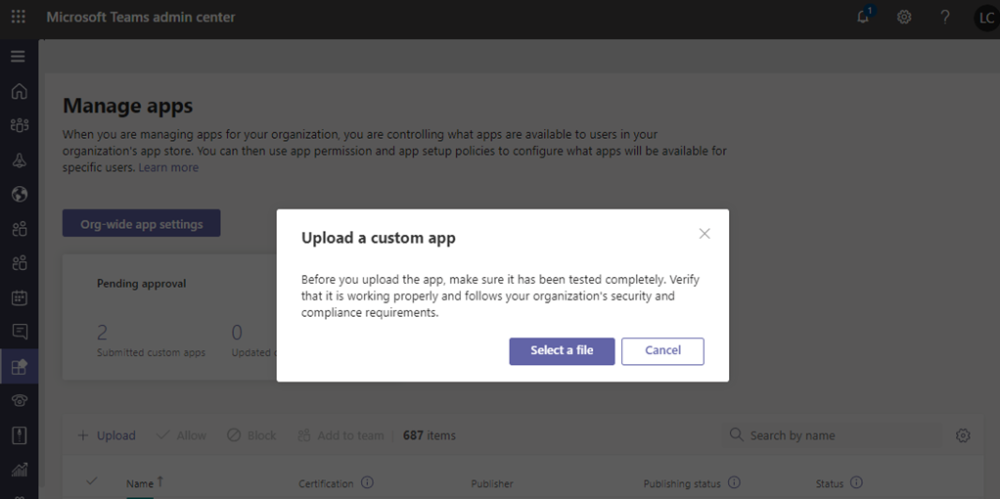

# 通过上载应用包发布自定义应用

> [!NOTE]
> 发布自定义团队应用时，用户可在组织的应用商店中使用。 发布自定义应用的方法有两种，使用方式取决于你获取该应用的方式。 **本文重点介绍如何发布自定义应用，方法是使用 (以 .zip 格式) 开发人员发送的方式上载该应用包**。 当开发人员通过团队应用提交 API 将应用直接提交到 "<a href="https://docs.microsoft.com/microsoftteams/manage-apps" target="_blank">管理应用</a>程序" 页面时，将使用另一个方法，即审批自定义应用。 若要了解有关该方法的详细信息，请参阅<a href="https://docs.microsoft.com/microsoftteams/submit-approve-custom-apps" target="_blank">发布通过团队应用提交 API 提交的自定义应用</a>。

本文提供了有关如何将你的团队应用从开发转到部署到发现的端到端指南。 本指南重点介绍应用的团队方面，并面向管理员和 IT 专业人士。 有关开发团队应用的详细信息，请参阅<a href="https://docs.microsoft.com/microsoftteams/platform" target="_blank">团队开发人员文档</a>。

## 开发

### 创建你的应用

Microsoft 团队开发人员平台使开发人员可以轻松地集成你自己的应用和服务，以提高工作效率、更快地做出决策以及围绕现有内容和工作流创建协作。 在团队平台上构建的应用是团队客户端和你的服务和工作流之间的桥梁，可直接将它们引入协作平台的上下文中。 有关详细信息，请转到<a href="https://docs.microsoft.com/microsoftteams/platform" target="_blank">团队开发人员文档</a>。

## 复核

### 获取应用包

当应用准备好在生产中使用时，开发人员应该生成一个应用包。 他们可以使用适用于该<a href="https://docs.microsoft.com/microsoftteams/platform/get-started/get-started-app-studio" target="_blank">应用的应用 Studio</a> 。 他们将以 .zip 格式发送文件。

Microsoft 使用<a href="https://docs.microsoft.com/microsoftteams/platform/publishing/office-store-approval" target="_blank">这些指南</a>确保应用符合全球团队应用商店的质量和安全标准。

### 允许受信任的用户上载自定义应用

若要验证应用是否在你的生产租户中正常工作，你需要允许你自己和/或受信任的用户在生产租户中上载自定义应用。 你可以使用<a href="https://docs.microsoft.com/microsoftteams/teams-app-setup-policies" target="_blank">应用设置策略</a>执行此操作。

> [!NOTE]
> 如果你不满意将应用上载到生产租户进行验证，即使对于你自己或受信任的用户，你也可以跳过此步骤，然后按照[上传](#upload)和[设置和管理](#set-up-and-manage)部分中的步骤将 unvalidated 应用发布到你的组织的应用商店。 然后，将对该应用的访问限制为仅限自己和你信任的用户。 然后，这些用户可以从您的组织的应用商店获取该应用以执行验证。 验证应用后，使用相同的权限策略打开 access，并将应用滚出以供生产使用。

若要允许受信任用户上载自定义应用程序，请按照下列步骤操作：

1. 启用 "**允许与自定义应用交互**" 组织范围的应用设置。 要执行此操作：
    1. 在 Microsoft 团队管理中心的左侧导航中，转到 "**团队应用**  >  **管理应用**"，然后单击 "**组织范围的应用设置**"。
    2. 在 "**自定义应用**" 下，打开 "**允许与自定义应用交互**"，然后单击 "**保存**"。
2. 关闭全局应用设置策略中的 "**上载自定义应用**" 设置。 要执行此操作：
    1. 在 Microsoft 团队管理中心的左侧导航中，转到 "**团队应用**  >  **设置策略**"，然后单击 "**全局 (组织范围的默认) **策略"。
    2. 关闭 "**上载自定义应用**"，然后单击 "**保存**"。
3. 创建一个新的应用设置策略，该策略允许上载自定义应用并将其分配给你的受信任的用户集。 要执行此操作：
    1. 在 Microsoft 团队管理中心的左侧导航中，转到 "**团队应用**  >  **设置策略**"，然后单击 "**添加**"。 为新策略提供名称和说明，打开 "**上载自定义应用**"，然后单击 "**保存**"。
    2. 选择您创建的新策略，然后单击 "**管理用户**"。 搜索用户，单击 "**添加**"，然后单击 "**应用**"。 重复此步骤，将策略分配给所有受信任的用户。

        

    这些用户现在可以上载应用清单，以验证应用是否在生产租户中正常工作。

## 加载

若要让你的组织的应用商店中的用户可以使用该应用，请上载该应用。 你可以在 Microsoft 团队管理中心的 "<a href="https://docs.microsoft.com/microsoftteams/manage-apps" target="_blank">管理应用</a>" 页面上执行此操作。

1. 在 Microsoft 团队管理中心的左侧导航中，转到 "**团队应用**  >  **管理应用**"。
2. 单击 "**上载**"，单击 "**选择文件**"，然后选择从开发人员处收到的应用包。

    

## 设置和管理

### 控制对应用的访问

默认情况下，组织中的所有用户都可以访问组织的应用商店中的应用。 若要限制和控制谁有权使用该应用程序，你可以创建并分配应用权限策略。 若要了解详细信息，请参阅<a href="https://docs.microsoft.com/microsoftteams/teams-app-permission-policies" target="_blank">管理团队中的应用权限策略</a>。

### 固定并安装应用以供用户发现

默认情况下，用户可以使用该应用程序找到你的组织的应用商店所需的应用，然后浏览或搜索它。 若要使用户可以轻松访问应用，可以将应用固定到团队中的应用栏。 若要执行此操作，请创建应用设置策略并将其分配给用户。 若要了解详细信息，请参阅<a href="https://docs.microsoft.com/microsoftteams/teams-app-setup-policies" target="_blank">管理团队中的应用设置策略</a>。

## 探索和采纳

具有应用权限的用户可以在你的组织的应用商店中找到它。 转到 "应用" 页面上的 "为***你的组织名称*生成**" 以查找你的组织的自定义应用。

如果你创建并分配了应用设置策略，应用将固定到团队中的应用栏，以便为分配了该策略的用户轻松访问。

## 更新

若要更新应用，开发人员应继续按照 "[开发](#develop)和[验证](#validate)" 部分中的步骤操作。

可以在 Microsoft 团队管理中心的 "管理应用程序" 页面上更新该应用。 若要执行此操作，请在 Microsoft 团队管理中心的左侧导航中，转到 "**团队应用**  >  **管理应用**"。 单击 "应用名称"，然后单击 "**更新**"。 执行此操作将替换现有应用，并且所有应用权限策略和应用设置策略都将对已更新的应用保持强制。

### 最终用户更新体验

在大多数情况下，完成应用更新后，最终用户将自动显示新版本。 但是，对<a href="https://docs.microsoft.com/microsoftteams/platform/resources/schema/manifest-schema" target="_blank">Microsoft 团队清单</a>有一些更新需要用户接受才能完成：

* 已添加或删除机器人
* 现有 bot 的 "botId" 属性已更改
* 现有 bot 的 "isNotificationOnly" 属性已更改
* Bot 的 "supportsFiles" 属性已更改
* 添加或删除了消息传递扩展
* 添加了新的连接器
* 添加了新的静态选项卡
* 添加了新的 "可配置" 选项卡
* "WebApplicationInfo" 中的属性已更改

## 相关主题

- [发布通过团队应用提交 API 提交的自定义应用](submit-approve-custom-apps.md)
- [在 Microsoft 团队管理中心中管理你的应用](manage-apps.md)
- [在 Teams 中管理自定义应用策略和设置](teams-custom-app-policies-and-settings.md)
- [在 Teams 中管理应用权限策略](teams-app-permission-policies.md)
- [在 Teams 中管理应用设置策略](teams-app-setup-policies.md)
