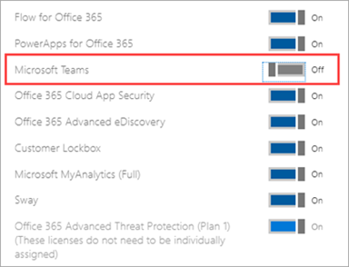

# <a name="manage-user-access-to-teams"></a>管理用户对 Teams 的访问管理

通过分配或删除 Microsoft Teams 产品许可证，在用户级别管理对 Teams 的访问权限。 除了匿名加入 Teams 会议外，组织中的每个用户必须具有 Teams 许可证才能使用 Teams。 可以在新建用户帐户时为新用户分配 Teams 许可证，也可以为具有现有帐户的用户分配 Teams 许可证。

默认情况下，当向用户分配许可计划 (例如 Microsoft 365 企业版 E3 或 Microsoft 365 商业高级版) 时，将自动分配 Teams 许可证，并且为该用户启用 Teams。 你随时可以通过删除或分配许可证来为用户禁用或启用 Teams。

使用从 Teams 管理中心管理的消息传送策略来控制 <a href="https://go.microsoft.com/fwlink/p/?linkid=2024339" target="_blank">Teams</a>中的用户可以使用哪些聊天和频道消息传送功能。 可以使用默认策略，或为组织成员创建一个或多个自定义消息传送策略。 若要了解有关详细信息，请阅读["在 Teams 中管理消息传送策略"。](messaging-policies-in-teams.md)
在 Microsoft 365 管理中心中或通过使用 PowerShell 管理 Teams 许可证。 只有全局管理员或用户管理管理员才能管理许可证。

> [!NOTE]
> 我们建议为所有用户启用 Teams，以便可以针对项目和其他动态计划有组织地组建团队。 即使正在运行试点，让所有用户都启用 Teams 可能也很有帮助，但仅面向试点用户组的通信。

## <a name="using-the-microsoft-365-admin-center"></a>使用 Microsoft 365 管理中心

Teams 用户级许可证直接通过 Microsoft 365 管理中心用户管理界面进行管理。 管理员可以在创建新用户帐户时为新用户分配许可证，也可以为已有帐户的用户分配许可证。 

> [!IMPORTANT]
> 管理员必须具有全局管理员或用户管理管理员权限才能管理 Microsoft Teams 许可证。
使用 Microsoft 365 管理中心一次管理单个用户或少量用户的 Teams 许可证。 可以在"许可证"页面上管理Teams 许可证 (最多同时为 20 个用户管理) **活动用户**"页面。 选择的方法取决于是管理特定用户的产品许可证，还是管理特定产品的用户许可证。

如果需要为大量用户（如数百或数千个用户）管理 Teams 许可证，请使用[Azure Active Directory ](https://docs.microsoft.com/azure/active-directory/users-groups-roles/licensing-groups-assign) (Azure AD) 中的[PowerShell](#using-powershell)或基于组的许可。 

### <a name="assign-a-teams-license"></a>分配 Teams 许可证

根据是使用"许可证"页还是"活动用户" **页面** ，步骤 **会** 有所不同。  有关分步说明，请参阅"[向用户分配许可证"。](https://docs.microsoft.com/microsoft-365/admin/manage/assign-licenses-to-users)

|||
|---------|---------|
|    |         |

### <a name="remove-a-teams-license"></a>删除 Teams 许可证

从用户删除 Teams 许可证时，将为该用户禁用 Teams，他们将不再在应用启动器或主页中看到 Teams。 有关详细步骤，请参阅["取消分配用户的许可证"。](https://docs.microsoft.com/microsoft-365/admin/manage/remove-licenses-from-users)

|||
|---------|---------|
|    |         |

## <a name="using-powershell"></a>使用 PowerShell

使用 PowerShell 批量管理用户的 Teams 许可证。 通过 PowerShell 启用和禁用 Teams 的方式与为任何其他服务计划许可证启用和禁用 Teams 的方式相同。 需要 Teams 服务计划的标识符，如下所示：

- Microsoft Teams：TEAMS1
- Microsoft Teams for GCC：TEAMS_GOV
- Microsoft Teams for DoD：TEAMS_DOD

### <a name="assign-teams-licenses-in-bulk"></a>批量分配 Teams 许可证

有关详细步骤，请参阅使用 [PowerShell 将许可证分配给用户帐户](https://docs.microsoft.com/office365/enterprise/powershell/assign-licenses-to-user-accounts-with-office-365-powershell)。

### <a name="remove-teams-licenses-in-bulk"></a>批量删除 Teams 许可证

有关详细步骤，请参阅"[使用 PowerShell](https://docs.microsoft.com/office365/enterprise/powershell/disable-access-to-services-with-office-365-powershell)禁用对服务的访问"和"分配用户许可证时禁用[对服务的访问权限"。](https://docs.microsoft.com/office365/enterprise/powershell/disable-access-to-services-while-assigning-user-licenses)

#### <a name="example"></a>示例 

以下示例演示了如何使用 [New-MsolLicenseOptions](https://docs.microsoft.com/powershell/module/msonline/new-msollicenseoptions) 和 [Set-MsolUserLicense](https://docs.microsoft.com/powershell/module/msonline/set-msoluserlicense) cmdlet 为具有特定许可计划的用户禁用 Teams。 例如，按照以下步骤首先为具有特定许可计划的所有用户禁用 Teams。 然后，为应有权访问 Teams 的每个用户启用 Teams。

> [!IMPORTANT]
> 除非 [在自定义脚本中显式标识，否则 New-MsolLicenseOptions](https://docs.microsoft.com/powershell/module/msonline/new-msollicenseoptions) cmdlet 将启用以前禁用的所有服务。 例如，如果要同时禁用 Exchange 和 Sway，同时禁用 Teams，则需要在脚本中包括此功能，否则将为标识的用户启用 Exchange 和 Sway。

运行以下命令，显示组织中所有可用的许可计划。 若要了解有关详细信息，请参阅["使用 PowerShell 查看许可证和服务"。](https://docs.microsoft.com/office365/enterprise/powershell/view-licenses-and-services-with-office-365-powershell)


```powershell
Get-MsolAccountSku
```

运行以下命令，其中组织名称和在上一步中检索到的许可 \<CompanyName:License> 计划的标识符。 例如，ContosoSchool：ENTERPRISEPACK_STUDENT。

```powershell
$acctSKU="<CompanyName:License>
$x = New-MsolLicenseOptions -AccountSkuId $acctSKU -DisabledPlans "TEAMS1"
```

运行以下命令，为拥有许可计划有效许可证的所有用户禁用 Teams。

```powershell
Get-MsolUser | Where-Object {$_.licenses[0].AccountSku.SkuPartNumber -eq  ($acctSKU).Substring($acctSKU.IndexOf(":")+1,  $acctSKU.Length-$acctSKU.IndexOf(":")-1) -and $_.IsLicensed -eq $True} |  Set-MsolUserLicense -LicenseOptions $x
```

## <a name="related-topics"></a>相关主题

- [Teams 附加许可证](teams-add-on-licensing/microsoft-teams-add-on-licensing.md)
- [分配 Teams 附加许可证](teams-add-on-licensing/assign-teams-add-on-licenses.md)
- [使用 PowerShell 查看许可证和服务](https://docs.microsoft.com/office365/enterprise/powershell/view-licenses-and-services-with-office-365-powershell)
- [用于许可的产品名称和服务计划标识符](https://docs.microsoft.com/azure/active-directory/users-groups-roles/licensing-service-plan-reference)
- [教育 SKU 参考](sku-reference-edu.md)
