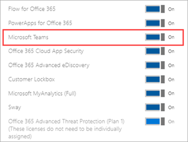

# 管理用户对 Teams 的访问管理

通过分配或删除 Microsoft 团队产品许可证，可在用户级别管理对团队的访问。 组织中的每个用户都必须拥有一个团队许可证，然后他们才能使用团队。 当创建新用户帐户或使用现有帐户向用户分配新用户帐户时，您可以为新用户分配团队许可证。

默认情况下，当 (授权计划时，将为用户分配 Microsoft 365 企业版 E3 或 Microsoft 365 Business Premium) ，将自动分配团队许可证，并为团队启用用户。 你可以随时删除或分配许可证，为用户禁用或启用团队。

使用邮件策略从 <a href="https://go.microsoft.com/fwlink/p/?linkid=2024339" target="_blank">团队管理中心</a>进行管理，以控制团队中的用户可以使用哪些聊天和频道消息功能。 你可以使用默认策略或为组织中的人员创建一个或多个自定义消息策略。 若要了解详细信息，请阅读 [团队中的 "管理消息策略](messaging-policies-in-teams.md)"。
可在 Microsoft 365 管理中心或通过使用 PowerShell 管理团队许可证。 您必须是全局管理员或用户管理管理员才能管理许可证。

> [!NOTE]
> 我们建议你为所有用户启用团队，以便团队可以为项目和其他动态计划 organically。 即使你正在运行试验，仍可让团队为所有用户启用团队，但仅将目标与用户的试点组通信。

## 使用 Microsoft 365 管理中心

团队用户级许可证通过 Microsoft 365 管理中心用户管理界面直接管理。 管理员可以在创建新用户帐户时为新用户分配许可证，也可以为已有帐户的用户分配许可证。 

> [!IMPORTANT]
> 管理员必须具有全局管理员权限或用户管理管理员权限才能管理 Microsoft 团队许可证。
使用 Microsoft 365 管理中心管理单个用户或一次小型用户组的团队许可证。 您可以在 "许可证" 页面上管理多达20个用户的 " **许可证** " 页面 (，) 或 " **活动用户** " 页面。 你选择的方法取决于你是要为特定用户管理产品许可证还是管理特定产品的用户许可证。

如果需要管理大量用户（如成百上千用户）的团队许可证，请 [使用](#using-powershell) [azure Active Directory 中的 Powershell 或基于组的许可 (azure AD) ](https://docs.microsoft.com/azure/active-directory/users-groups-roles/licensing-groups-assign)。 

### 分配团队许可证

根据您使用的是 " **许可证** " 页面还是 " **活动用户** " 页面，这些步骤会有所不同。  有关分步说明，请参阅 [向用户分配许可证](https://docs.microsoft.com/microsoft-365/admin/manage/assign-licenses-to-users)。

|||
|---------|---------|
|    |         |

### 删除团队许可证

从用户删除团队许可证时，将对该用户禁用团队，并且他们将不再在应用启动器或主页中看到团队。 有关详细步骤，请参阅 [取消分配给用户的许可证](https://docs.microsoft.com/microsoft-365/admin/manage/remove-licenses-from-users)。

|||
|---------|---------|
|    |         |

## 使用 PowerShell

使用 PowerShell 批量管理用户的团队许可证。 通过 PowerShell 启用和禁用团队的方式与任何其他服务计划许可证的方式相同。 你将需要团队服务计划的标识符，如下所示：

- Microsoft 团队： TEAMS1
- 适用于 GCC 的 Microsoft 团队： TEAMS_GOV
- 适用于 DoD 的 Microsoft 团队： TEAMS_DOD

### 批量分配团队许可证

有关详细步骤，请参阅 [使用 PowerShell 向用户帐户分配许可证](https://docs.microsoft.com/office365/enterprise/powershell/assign-licenses-to-user-accounts-with-office-365-powershell)。

### 批量删除团队许可证

有关详细步骤，请参阅 [使用 PowerShell 禁用对服务的访问](https://docs.microsoft.com/office365/enterprise/powershell/disable-access-to-services-with-office-365-powershell) ，并 [在分配用户许可证时禁用对服务的访问](https://docs.microsoft.com/office365/enterprise/powershell/disable-access-to-services-while-assigning-user-licenses)。

#### 示例 

下面是如何使用 [MsolLicenseOptions](https://docs.microsoft.com/powershell/module/msonline/new-msollicenseoptions) 和 [MsolUserLicense](https://docs.microsoft.com/powershell/module/msonline/set-msoluserlicense) cmdlet 为具有特定授权计划的用户禁用团队的示例。 例如，请按照以下步骤操作，首先针对具有特定授权计划的所有用户禁用团队。 然后为应该有权访问团队的每个单独用户启用团队。

> [!IMPORTANT]
> 除非在自定义脚本中明确标识，否则 [MsolLicenseOptions](https://docs.microsoft.com/powershell/module/msonline/new-msollicenseoptions) cmdlet 将启用之前已禁用的所有服务。 例如，如果你希望同时禁用 Exchange 和 Sway 同时禁用团队，你需要在脚本中包含此内容，或者将为你标识的用户启用 Exchange 和 Sway。

运行以下命令以显示你的组织中的所有可用授权计划。 若要了解详细信息，请参阅 [通过 PowerShell 查看许可证和服务](https://docs.microsoft.com/office365/enterprise/powershell/view-licenses-and-services-with-office-365-powershell)。

      Get-MsolAccountSku

运行以下命令，其中 \<CompanyName:License> 是你的组织名称和你在之前步骤中检索的授权计划的标识符。 例如，ContosoSchool： ENTERPRISEPACK_STUDENT。

      $acctSKU="<CompanyName:License>
      $x = New-MsolLicenseOptions -AccountSkuId $acctSKU -DisabledPlans "TEAMS1"

运行以下命令，为具有许可计划的活动许可证的所有用户禁用团队。

      Get-MsolUser | Where-Object {$_.licenses[0].AccountSku.SkuPartNumber -eq  ($acctSKU).Substring($acctSKU.IndexOf(":")+1,  $acctSKU.Length-$acctSKU.IndexOf(":")-1) -and $_.IsLicensed -eq $True} |  Set-MsolUserLicense -LicenseOptions $x

## 管理组织级别的团队

[!INCLUDE [global-switch-expiry-note](includes/global-switch-expiry-note.md)]

## 相关主题

- [团队附加设备许可证](teams-add-on-licensing/microsoft-teams-add-on-licensing.md)
- [分配团队附加设备许可证](teams-add-on-licensing/assign-teams-add-on-licenses.md)
- [通过 PowerShell 查看许可证和服务](https://docs.microsoft.com/office365/enterprise/powershell/view-licenses-and-services-with-office-365-powershell)
- [用于许可的产品名称和服务计划标识符](https://docs.microsoft.com/azure/active-directory/users-groups-roles/licensing-service-plan-reference)
- [教育 SKU 参考](sku-reference-edu.md)