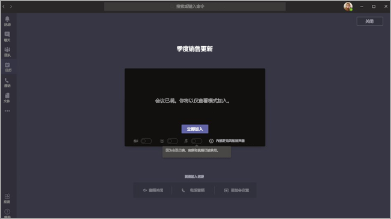

# <a name="teams-view-only-meeting-experience"></a>Teams 仅查看会议体验

> [!Note]
> Microsoft 365 E3/E5 和 Microsoft 365 A3/A5 中提供了仅查看广播。 该功能将于 2021 年 3 月 1 日启用，默认为“关闭”。 Microsoft 365 政府社区云 (GCC) 中的该功能将于 2021 年 3 月底开始推出。 政府社区云高 (GCCH) 和国防部 (DoD) 将在日后推出。 如果想让该功能默认为 “启动”，必须在该日期之后更改默认策略。 使用 PowerShell 启用策略 `Set-CsTeamsMeetingPolicy -Identity Global -StreamingAttendeeMode Enabled`。

> [!Note]
> 如果会议或网络研讨会达到饱和状态，Teams 将无缝扩展至容纳 10,000 人的仅限观看广播体验。 另外，在这个远程工作增加的时期，利用更大规模的 20,000 人广播到今年年底。

Microsoft Teams 允许最多 10,000 名与会者加入一个 Teams 会议。 达到主会议的容量后 (1000 个用户进入会议) ，其他与会者将加入仅查看体验。

首先加入会议的与会者（最多为主会议的容量）将获得完整的Teams体验。 他们可以共享音频和视频、查看共享视频、并参与会议聊天。

在达到主会场容量后加入的与会者将有仅查看体验。

与会者可以通过 Android 和 iOS Teams桌面、Web 和 (加入仅) 。

> [!Note]
> "主会议"的当前限制容量（换句话说，完全交互式用户数）为 1000，包括GCC。

## <a name="teams-view-only-experience-controls"></a>Teams仅查看体验控件

使用 PowerShell 启用仅查看体验。

```PowerShell
Set-CsTeamsMeetingPolicy -Identity Global -StreamingAttendeeMode Enabled
```

若要禁用仅查看体验，还可使用 PowerShell。

```PowerShell
Set-CsTeamsMeetingPolicy -Identity Global -StreamingAttendeeMode Disabled
```

将来，你将能够在管理中心启用或禁用仅Teams体验。

## <a name="impact-to-users"></a>对用户的影响

用户的体验会因多种因素而有所不同。

当主会场容量已满时，如有下列情况之一，与会者将无法参加会议:

- 管理员已禁用Teams或整个租户的仅查看体验。
- 仅查看与会者不能绕过大厅。 例如，如果会议的组织者选择仅让"我的组织内部人员"绕过大厅，而组织外部的与会者尝试以仅查看与会者的与会者加入，他们将无法加入。

当达到主会议的容量时，会议组织者和演示者将看到一个横幅，通知他们新与会者将作为仅查看的与会者加入。

  

当达到主会议的容量时，会议平台会在预加入界面上通知他们以仅查看模式加入。

  

如果有空间，用户将始终加入主会议。 如果主会场达到容纳量，有一名或多名与会者离开主会场，则主会场有可用容量。 加入 (或重新加入) 会议的与会者将加入主会议，直到会议再次达到饱和。 具有仅查看体验的与会者不会自动提升为主会议，并且无法手动提升为主会议。

如果已设置演示者和与会者角色，并且演示者在主会议达到容量后尝试加入会议，他们将作为仅查看的与会者加入，并且与其他仅查看的与会者具有相同的限制。 支持确保所有演示者加入主会议将在以后推出。 组织者将始终获得主会议空间保证。

## <a name="impact-to-meeting-presenters-and-organizers"></a>对会议演示者和组织者的影响

会议演示者和组织者的限制包括：

- 你不会有任何关于仅查看与会者的信息。 我们不支持仅查与会者的电子数据展示。
- 主会议中的用户看不到仅查看与会者。
- 不能从会议中删除仅查看的与会者。

> [!Note]
> 与会者计数仅反映主会议中的人员，而不是仅查看会议室中的人员。 因此，演示者无法准确统计仅查看体验中的用户。

## <a name="experience-for-view-only-attendees"></a>仅查看与会者的体验

通过 Teams 的仅查看体验，与会者可以:

- 收听主 Teams 会议中参与者的发言。
- 查看当前发言者的视频源 (如果当前发言者正在共享视频)。
- 查看使用共享桌面或屏幕功能共享的内容。

仅查看中的与会者将无法在会议中体验以下选项:

- 如果与会者没有根据设定的大厅政策或选项绕过大厅的权限，加入会议。
- 使用音频会议加入仅查看会议室。
- 使用 CVI 服务Microsoft Teams 会议室云视频互操作 (仅查看) 聊天室。
- 共享他们的音频或视频。
- 查看或参与会议聊天。
- 除非与会者是主动发言的人，否则可以看到会议参与者的视频源。
- 请参阅PowerPoint Live 功能或单个应用程序共享PowerPoint桌面或屏幕共享功能共享 (共享的文件) 。
- 在会议中举手。
- 发送或查看回应。
- 与集成到会议会议的任何 3P Teams交互，包括投票。

## <a name="view-only-feature-limitations"></a>仅查看功能限制

- 仅查看与会者只能在桌面和 Web 上看到实时字幕。 目前只支持英文字幕。
- 仅查看的与会者将得到流媒体处理技术的支持。
- 仅查看的与会者不会列入出席报告中。
- 仅查看的与会者将有单一的视频体验。 他们可以看到活动发言人或共享的内容，但不能两者同时看到。
- 我们当前不支持 **库**、**大型库** 或仅供与会者浏览的 **同框场景模式**。  
- 仅查看的与会者不会有和普通与会者一样的延迟。 <sup>1</sup>

  <sup>1</sup> 仅查看的与会者将在会议上有 30 秒的视频和音频延迟。  
