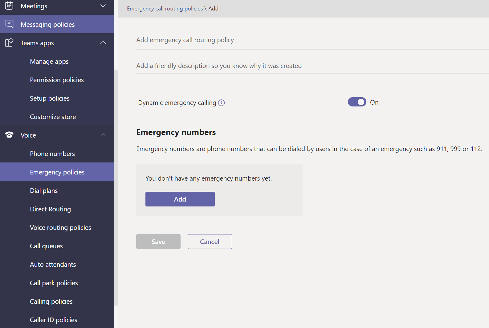
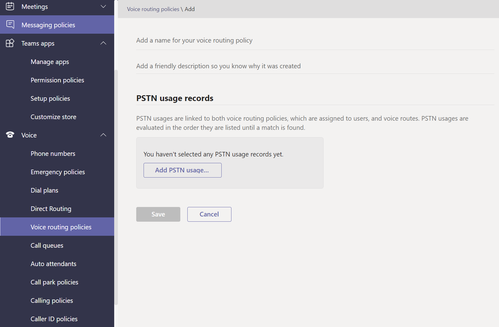

# 在 Microsoft Teams 中管理语音和呼叫策略

语音和呼叫策略用于控制 Microsoft Teams 中的语音和呼叫。

## 紧急呼叫策略

使用 [紧急呼叫策略](manage-emergency-calling-policies.md) 来配置当组织中用户进行紧急呼叫时会发生什么情况。 这些策略在 Teams 管理中心内管理，或者使用 Windows PowerShell。

## 紧急呼叫路由策略

如果组织已部署电话系统直接 **路由**，可以使用紧急呼叫路由策略 来确定紧急呼叫的路由位置、是否启用了增强的紧急服务，以及用于紧急服务的电话号码。 这些策略使用 PowerShell 或 Microsoft Teams 管理中心进行管理。

## 调用方 ID 策略

[调用方 ID](caller-id-policies.md) 策略用于更改或阻止来电显示。

## 语音路由策略

语音 [路由策略](manage-voice-routing-policies.md) 是一个容器，用于公用电话交换网络 (PSTN) 使用情况记录。 如果组织已部署电话系统直接路由，可以使用 **这些策略**。 可以使用 PowerShell 或 Teams 管理中心管理语音路由策略。

## 通话策略

[呼叫策略](teams-calling-policy.md) 控制哪些呼叫和呼叫转发功能可供用户使用，包括用户是否可以进行私人呼叫、将呼叫发送到呼叫组以及将呼叫路由到语音邮件。

## 呼叫停放和检索策略

[呼叫暂停和检索](call-park-and-retrieve.md) 允许用户将其他用户置于保持状态，使同一用户或其他人能够继续呼叫。

## 创建并管理拨号计划

[拨号计划](create-and-manage-dial-plans.md) 转换拨入的电话号码，进行呼叫授权和路由。 可以通过 PowerShell 或 Microsoft Teams 管理中心创建和管理拨号计划。

## 相关主题

* [在 Microsoft Teams 中管理紧急呼叫策略](manage-emergency-calling-policies.md)
* [管理紧急呼叫路由策略](manage-emergency-call-routing-policies.md)
* [在 Microsoft Teams 中管理来电显示策略](caller-id-policies.md)
* [管理语音路由策略](manage-voice-routing-policies.md)
* [Microsoft Teams 中的呼叫策略](teams-calling-policy.md)
* [Microsoft Teams 中的呼叫寄存和取回](call-park-and-retrieve.md)
* [创建并管理拨号计划](create-and-manage-dial-plans.md)
* [使用策略管理 Teams](manage-teams-with-policies.md)
