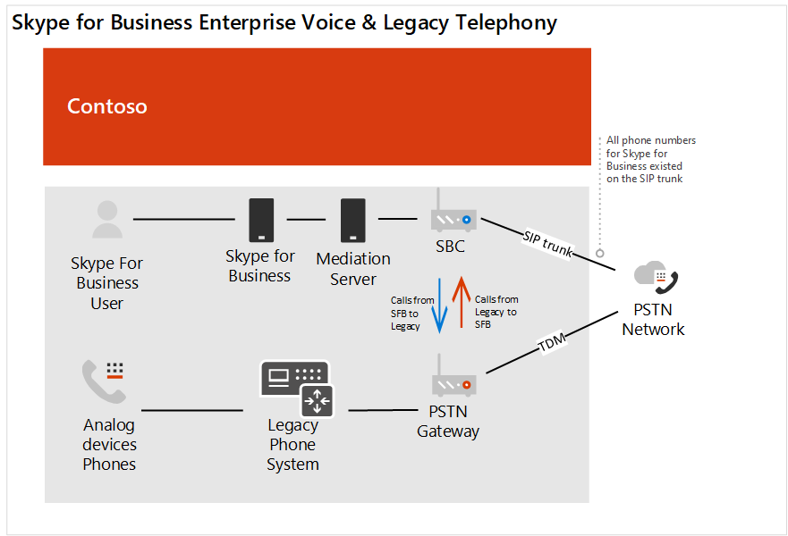

# Contoso 案例研究：电话系统Contoso case study: Phone System

根据地理位置和其他因素，Contoso 拥有使用以下电话服务解决方案的办事处：Depending on geographic location and other factors, Contoso had offices using the following telephony solutions:

- 网站类型 A： Skype for Business 企业语音Site Type A: Skype for Business Enterprise Voice

- 网站类型 B：传统的旧电话系统Site Type B: Traditional legacy telephony systems

- 网站类型 C： Skype for Business 企业语音和传统旧式电话系统的组合Site Type C: A combination of Skype for Business Enterprise Voice and traditional legacy telephony systems

若要为整个组织实施 Microsoft Phone 系统解决方案，Contoso 必须确定 &mdash; 每个网站类型将 &mdash; 以下哪一种选项与电话系统一起使用才能连接到公共交换式电话网络（PSTN）：To implement a Microsoft Phone System solution for their entire organization, Contoso had to determine&mdash;for each site type&mdash;which of the following options would be used with Phone System to connect to the Public Switched Telephone Network (PSTN):

- 带有呼叫计划的电话系统Phone System with Calling Plan 

- 通过直接路由使用自己的 PSTN 运营商的电话系统Phone System with own PSTN carrier through Direct Routing 

- 通过直接路由将电话系统与呼叫计划和电话系统结合到自己的 PSTN 运营商Combination of Phone System with Calling Plan and Phone System with own PSTN carrier through Direct Routing
 
为了为其组织确定合适的解决方案，Contoso 使用[microsoft 电话服务解决方案](https://docs.microsoft.com/SkypeForBusiness/hybrid/msft-telephony-solutions)和[microsoft 团队中](https://myignite.techcommunity.microsoft.com/sessions/83170?source=sessions)的 Ignite 2019 会话通话。To determine the right solution for their organization, Contoso used [Microsoft telephony solutions](https://docs.microsoft.com/SkypeForBusiness/hybrid/msft-telephony-solutions) and the Ignite 2019 session [Calling in Microsoft Teams](https://myignite.techcommunity.microsoft.com/sessions/83170?source=sessions).  

## 网站类型 A： Skype for Business 企业语音Site Type A: Skype for Business Enterprise Voice 

Contoso Skype for business 企业语音已设置为中心和分支。Contoso Skype for Business Enterprise Voice was set up as a hub and spoke. 有一个中心位置，它在为国家/地区的 Skype for business Enterprise Voice 用户提供 PSTN 网关的区域中维护 PSTN 网关。There was a central location that maintained the PSTN gateway in the region that provided the connection to the PSTN for the Skype for Business Enterprise Voice users in country. 这些卫星办公室通常没有自己的 Internet 出口。Often these satellite offices did not have their own Internet egress. 这些用户的数字驻留在与现有 SBC 连接的 SIP 中继上。The numbers for these users resided on the SIP trunk connecting to an existing SBC. 

为了确定已部署的 SBC 是否已针对直接路由和媒体绕过认证，Contoso 检查了[认证为直接路由的会话边框控制器列表](direct-routing-border-controllers.md)。To determine if the SBC already deployed is certified for Direct Routing and Media Bypass, Contoso checked the [List of Session Border Controllers certified for Direct Routing](direct-routing-border-controllers.md).  

用户的拨号习惯是使用扩展在旧式电话系统上拨出用户，即使用户有适用于对等音频的 Skype for Business 客户端也是如此。The user's dialing habits were to dial a user on the legacy telephony system using an extension, even when the user has a Skype for Business client available for peer-to-peer audio. 

Contoso 基于以下问题做出决策：Contoso based their decision on the following questions:

- 问：Q. 我们是否需要保留本地部署提供的功能？Do we need to retain functionality provided by our on-premises deployment? 
  答：A. 否No 

- 问：Q. 我们是否需要与第三方 PBX 系统和其他电话设备互操作？Do we need to interoperate with third-party PBX systems and other telephony equipment? 
  答：A. 否No 

- 问：Q. 我们是否需要保留当前的第三方运营商？Do we need to retain our current third-party carrier?  答：是（管控国家），不A. Yes (regulated countries) and No 

- 问：Q. 我们是否需要在部署 SBCs 上获得 ROI？Do we need to get the ROI on SBCs deployed?  答：是和否A. Yes and No  

- 问：Q. 此地区是否提供 Microsoft PSTN 呼叫计划？Is Microsoft PSTN Calling Plans available in this region?  答：是和否A. Yes and No 

根据问题的答案，Contoso 决定：Based on the answers to their questions, Contoso decided to:

- 将位于 PSTN 呼叫计划的区域中的用户移动到使用呼叫计划的电话系统。Move the users that are located in a region where PSTN calling plans is available to Phone System with Calling Plans. 

- 移动不在 PSTN 呼叫计划可用的区域中的用户、位于 SBCs 的 ROI 尚未满足的网站中的用户以及驻留在使用直接路由的电话系统所在国家/地区的用户。Move the users that are not located in a region where PSTN calling plans is available, users located in a site where the ROI on the SBCs have yet to be met, and users that resided in a country that has telephony regulations to Phone System with Direct Routing. 

下图显示了初始 Skype for Business 企业语音部署以及如何将此部署迁移到 Microsoft 通话计划和直接路由：The following diagram shows the initial Skype for Business Enterprise Voice deployment and how this deployment was migrated to both Microsoft Calling Plans and Direct Routing:

## 网站类型 B：传统的旧电话系统Site Type B: Traditional legacy telephony systems

Contoso 拥有许多利用旧式电话系统的办事处。Contoso had many offices that leveraged legacy telephony systems. 有一个具有 E 1.64 电话号码的用户子集，而其他用户仅有一个扩展名。There were a subset of users that had an E1.64 phone number while others only had an extension. 这些号码驻留在用于 PSTN 网关的 TDM 主干中。These numbers resided on the TDM trunk to the PSTN gateway. 站内拨号是通过在扩展的前面利用站点代码来确定呼叫路由的位置来配置的。Intra-site dialing was configured by leveraging a site code in front of the extension to determine where to route the call. 用户的拨号习惯是通过分机号码拨号。The users' dialing habits were to dial by extension.   

Contoso 基于以下问题做出决策：Contoso based their decision on the following questions:

- 问：Q. 我们是否需要保留本地部署提供的功能？Do we need to retain functionality provided by our on-premises deployment? 
  答：A. 否No 

- 问：Q. 我们是否需要与第三方 PBX 系统和其他电话设备互操作？Do we need to interoperate with third-party PBX systems and other telephony equipment?  答：是A. Yes

- 问：Q. 我们是否需要保留当前的第三方运营商？Do we need to retain our current third-party carrier?  A. 否A. No 

- 问：Q. 我们的地区是否提供 Microsoft PSTN 的呼叫计划？Is Microsoft PSTN's Calling Plan available in our region?  答：是和否A. Yes and No 

根据问题的答案，Contoso 决定：Based on the answers to their questions, Contoso decided to: 

- 将位于 PSTN 呼叫计划的区域中的用户移动到使用呼叫计划的电话系统。Move the users that are located in a region where PSTN calling plans is available to Phone System with Calling Plans. 

- 将没有位于 PSTN 呼叫计划的区域中的用户移动到使用直接路由的电话系统。Move the users that are not located in a region where PSTN calling plans is available to Phone System with Direct Routing. 

- 维护与业务关键模拟设备的 PSTN 连接。Maintain a PSTN connection to business critical analog devices.

下图显示了具有远程站点的原始旧系统部署以及使用本地媒体优化迁移到直接路由部署的步骤：The following diagrams show the original legacy system deployment with remote sites and the migration to a Direct Routing deployment with Local Media Optimization:

**原始旧部署**  
 **Original legacy deployment** 

**直接路由的部署****Deployment with Direct Routing**

 
## 网站类型 C： Skype for Business 企业语音和传统旧式电话系统的组合Site Type C: Combination of Skype for Business Enterprise Voice and traditional legacy telephony systems

Contoso Skype for business 企业语音用户的号码驻留在来自运营商的 SBC 的 SIP 主干中。Contoso Skype for Business Enterprise Voice users' numbers reside on the SIP trunk to the SBC from the carrier. 传统电话系统的号码驻留在 TDM 主干网关。The numbers for the traditional telephony systems resided on the TDM trunk to the PSTN gateway.   

Contoso 基于以下问题做出决策：Contoso based their decision on the following questions:

- 问：Q. 我们是否需要保留本地部署提供的功能？Do we need to retain functionality provided by our on-premises deployment? 
  答：A. 否No 

- 问：Q. 我们是否需要与第三方 PBX 系统和其他电话设备互操作？Do we need to interoperate with third-party PBX systems and other telephony equipment?  A. 否A. No 

- 问：Q. 我们是否需要保留当前的第三方运营商？Do we need to retain our current third-party carrier?  A. 否A. No 

- 问：Q. 我们是否需要在部署 SBCs 上获得 ROI？Do we need to get the ROI on SBCs deployed?  答：是和否A. Yes and No  

- 问：Q. 此地区是否提供 Microsoft PSTN 呼叫计划？Is Microsoft's PSTN Calling Plan available in this region?  A. 否A. No 

根据问题的答案，Contoso 决定以下事项：Based on the answers to their questions, Contoso decided on the following: 

- 对于将为其启用直接路由的传统电话用户，Contoso 将这些号码从 TDM 主干移植到了 SBC 的 SIP 主干，因为 SBC 经认证可直接路由。For the legacy telephony users that will be enabled for Direct Routing, Contoso ported the numbers from the TDM trunk to the SIP Trunk for the SBC, since the SBC is certified for Direct Routing. 

- 若要支持移动到手机系统的用户的子集，并允许通过旧系统继续路由，则将旧电话系统设置为 SBC 的下一跃点。To support a subset of users moving to Phone System and to allow continued routing through the legacy system, the legacy telephony system was set up as the next hop to the SBC.   

- 此外，为了鼓励用户行为更改和删除在站点内部和站点内扩展拨号的相关性，Contoso 提供了用于所有内部通话的团队的指南。In addition, to encourage user behavior change and remove the dependency on inter- and intra-site extension dialing, Contoso provided guidance to use Teams for all internal calls.  

下图显示了最初的 Skype for Business 企业语音和旧式电话系统部署以及使用直接路由迁移到混合部署的步骤：The following diagrams show the original Skype for Business Enterprise Voice and legacy telephony system deployment and the migration to a mixed deployment using Direct Routing:

**原始混合部署** 
 **Original mixed deployment**

**直接路由** 
 **Mixed deployment with Direct Routing**

## 通话套餐Calling Plans

为了确定呼叫计划的配置要求，Contoso 已检查[通话计划核心部署决策](calling-plan-landing-page.md#core-deployment-decisions)。To determine the configuration requirements for Calling Plans, Contoso reviewed the [Calling Plan core deployment decisions](calling-plan-landing-page.md#core-deployment-decisions). 最终做出的决策：The resulting decisions were made: 

- 问：Q. 我的用户是否需要国际通话？Do my users need international calling?  答：是A. Yes 

- 问：Q. 我的用户是否有直接向内拨电话号码？Do my users each have a direct inward DID phone number?  。不是今天。A. Not today. 所有启用的用户都将收到 "已启用"。All users enabled will receive a DID. 

- 问：Q. 我是否希望屏蔽或禁用来电显示？Do I want to mask or disable caller ID?  A. 用户的呼叫方 ID 将被屏蔽到 Contoso 的本地号码。A. The caller ID for a user will be masked to the local number for Contoso. 

## 直接路由Direct Routing

Contoso 参与了 Ignite，以保持最新的 Office 365 功能，包括可通过电话系统和直接路由使用的功能。Contoso attended Ignite to stay current on Office 365 features including those available with Phone system and Direct Routing. 技术领导和架构师使用在 Ignite 2019 期间提供的指南确定其方向。Technical leadership and architects used the guidance provided during the Ignite 2019 to determine their direction.  使用的关键会话：Key sessions that were used: 

- [通过 Microsoft 团队直接路由来规划成功Plan for success with Microsoft Teams Direct Routing](https://myignite.techcommunity.microsoft.com/sessions/80381?source=sessions)

- [直接路由更新Updates for Direct Routing](https://myignite.techcommunity.microsoft.com/sessions/80381?source=sessions)

## 配置Configuration

### 通话计划网站Calling Plans sites

要获取许可证并为用户分配电话号码，Contoso 按照[设置通话计划](set-up-calling-plans.md)中的步骤进行操作。To obtain licenses and assign phone numbers to users, Contoso followed the steps in [Set up Calling Plans](set-up-calling-plans.md). 

由于需要分配电话号码的用户数，Contoso 决定使用 PowerShell 分配电话号码。Due to the number of users that needed to be assigned phone numbers, Contoso decided to use PowerShell to assign the phone numbers. 若要了解如何使用 PowerShell 分配号码 &mdash; 以及其他设置， &mdash; Contoso 使用[团队 PowerShell 概述](teams-powershell-overview.md)。To learn how to assign numbers by using PowerShell&mdash;in addition to other settings&mdash;Contoso used the [Teams PowerShell Overview](teams-powershell-overview.md).  

### 直接路由网站Direct Routing sites

要将 Contoso 的本地电话基础结构连接到 Microsoft 团队，Contoso 管理员按照[配置直接路由](direct-routing-configure.md)和查看[microsoft 团队中的视频直接路由中](https://www.youtube.com/watch?v=1ASftX_Msb8&index=10&list=PLaSOUojkSiGnKuE30ckcjnDVkMNqDv0Vl)的步骤进行操作。To connect Contoso's on-premises telephony infrastructure to Microsoft Teams, Contoso's administrator followed the steps in [Configure Direct Routing](direct-routing-configure.md) and reviewed the video [Direct Routing in Microsoft Teams](https://www.youtube.com/watch?v=1ASftX_Msb8&index=10&list=PLaSOUojkSiGnKuE30ckcjnDVkMNqDv0Vl) for guidance.  Contoso 还通过认证的 SBC 供应商引用直接路由部署文档。Contoso also referred to the Direct routing deployment documentation by the certified SBC vendor. 

在 SBC 和 Microsoft Phone 系统之间配置了直接路由后，Contoso 必须对该配置进行测试。Once Direct Routing was configured between the SBC and Microsoft Phone System, it was necessary for Contoso to test the configuration. 为此，Contoso 管理员使用在[Ignite 2019 的直接路由会话更新](https://myignite.techcommunity.microsoft.com/sessions/83178?source=sessions)中讨论的 SIP 测试客户端。To do this, Contoso administrators used the SIP Tester client that was discussed in the [Updates for Direct Routing session at Ignite 2019](https://myignite.techcommunity.microsoft.com/sessions/83178?source=sessions). SIP 测试客户端脚本和文档已从 PowerShell 脚本下载以测试直接路由会话边界控制器连接。The SIP Tester client script and documentation was downloaded from the PowerShell script to test Direct Routing Session Border Controller connections.   

### 本地媒体优化Local Media Optimization

Contoso 在全球不同地区看到了利用本地媒体优化的机会。Contoso saw the opportunity to leverage Local Media Optimization in the different regions across the globe. [用于直接路由的本地媒体优化](direct-routing-media-optimization.md)中介绍了 Contoso 支持的方案。The supported scenarios for Contoso are described in [Local Media Optimization for Direct Routing](direct-routing-media-optimization.md). 通过遵循 SBC 供应商和 Microsoft 的指南完成本地媒体优化的配置。The configuration of the local media optimization was completed by following guidance from both the SBC vendor and Microsoft. 本地媒体优化的配置步骤包括：The configuration steps for Local Media Optimization include: 

- 配置用户和 SBC 网站Configure the user and SBC sites 

- 根据 SBC 供应商规范配置 SBC，Configure the SBC  according to the SBC vendor specification, 

- 将外部受信任的 IP 地址添加到用于本地媒体优化的每个网站Add external trusted IP addresses to each site used for Local Media Optimization    

- 定义网络拓扑Define the network topology 

- 定义虚拟网络拓扑Define the virtual network topology 

- 确定模式：始终绕过或仅适用于本地用户Determine the mode: Always Bypass or Only for local users 

## 网络注意事项Networking considerations

Contoso 在启用电话系统后，有多个用户需要在多长时间内进行远程工作。Contoso had a number of users who needed to work remotely for an extended period of time after they were enabled for Phone System. 使用 VPN 访问特定的业务线应用程序的用户。The users used VPN to access certain Line of Business applications. 在使用 VPN 时，电话系统用户遇到通话质量下降。While on VPN, the Phone System users experienced a degradation of call quality. 

为了解决质量问题，Contoso 实现了 VPN 拆分隧道，该隧道允许其 Office 365 通信在 Internet 上保持与内部应用的连接时通过 Internet。To resolve the quality issue, Contoso implemented VPN split tunneling, which allowed their Office 365 traffic to traverse the Internet while the connection to the internal apps remained on the VPN. 若要实现 VPN 拆分隧道，Contoso 遵循[实现 Office 365 的 vpn 拆分隧道](https://docs.microsoft.com/office365/enterprise/office-365-vpn-implement-split-tunnel)的指南。To implement VPN split tunneling, Contoso followed the guidance in [Implementing VPN split tunneling for Office 365](https://docs.microsoft.com/office365/enterprise/office-365-vpn-implement-split-tunnel).  

 

